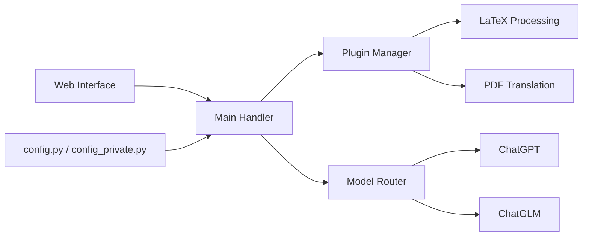

# binary-husky/gpt_academic

> Interface Gradio chinoise d'outils LLM pour la recherche : traduire, relire et résumer des articles.

## Le problème
Traduire un article arXiv, corriger un LaTeX ou résumer un PDF avec un LLM demande des copier-coller fastidieux et une mise en forme à refaire.

## Ce que ça fait vraiment
Une interface web où chaque bouton est une fonction ou un plugin (générés depuis `functional.py`) : traduction fine d'articles arXiv (Docker), traduction et relecture LaTeX, traduction de PDF, résumé de papiers, analyse de projets de code, commentaires en lot, conversation vocale.
Plusieurs LLM à la fois : OpenAI, Qwen, GLM, DeepSeek, ChatGLM/MOSS en local. Configuration par `config.py`, surchargée par `config_private.py`, puis par les variables d'environnement.

## Comment c'est branché


## Essayer
```bash
git clone --depth=1 https://github.com/binary-husky/gpt_academic.git
cd gpt_academic
python -m pip install -r requirements.txt
```
La commande de lancement n'est pas dans la partie lue du README.

## Coût et pièges
Clés d'API à ta charge (plusieurs admises à la fois) ; les modèles locaux (ChatGLM4 : 24 Go de VRAM) exigent un GPU. Licence GPL-3.0.

## Ce que ce n'est pas
Pas une bibliothèque : le paquet `void-terminal` pour l'appeler depuis Python est « en développement ». Interface et documentation surtout en chinois ; plusieurs modèles cités (MOSS, Newbing) sont datés.

## Alternatives
Aucune alternative nommée dans le README.

## Pour toi
À ignorer : Claude Code ou tes propres skills couvrent la traduction et la relecture de papiers avec moins de dépendances.
