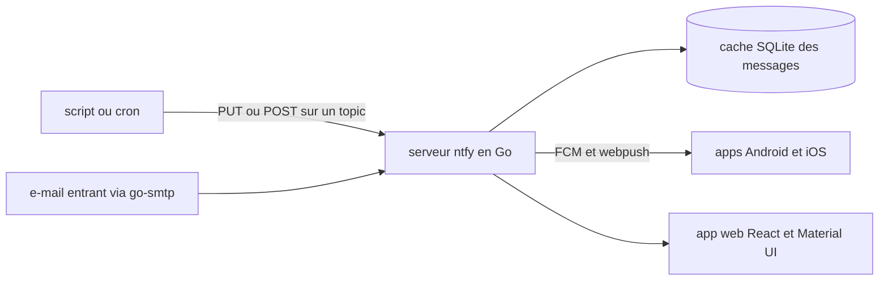

# binwiederhier/ntfy

> **Push a notification to your phone from a script, with a plain HTTP request.**

## The problem

Telling a human that a job finished, a backup broke or a training run diverged normally means an
account with a push provider, an API key, an SDK and a mobile integration. Without that, you fall
back on e-mail, which nobody reads in time.

## What it actually does

ntfy is an HTTP-based pub-sub notification service. You publish a message to a *topic* with
PUT/POST, and every subscriber to that topic receives it: an Android app, an iOS app, or the web
app. The README stresses two things: no sign-up and no fee for the free version, and the service
being open source, so you can run your own instance. The server is written in Go, the web app in
React with Material UI; the persistent message cache uses SQLite, delivery to mobiles goes through
Firebase Cloud Messaging and webpush-go, and an embedded SMTP server (go-smtp) can receive
e-mails. The mobile apps live in separate repositories, `binwiederhier/ntfy-android` and
`binwiederhier/ntfy-ios`.

## How it is wired



The server is the single central piece: it accepts publications on the input side, keeps them in a
persistent SQLite message cache, then pushes them to subscribers. The README names no source file,
only the third-party libraries used for each of those roles; the split above is inferred from that
and nothing more.

## Trying it

```bash
# The README carries no copyable command: a screenshot shows a curl call, but its text is not in
# the README. Install and API are delegated to https://ntfy.sh/docs/install/ and
# https://ntfy.sh/docs/publish/
```

No command is documented in the README itself. The hosted service is at ntfy.sh, and the mobile
apps are on Google Play, F-Droid and the App Store.

## Cost and traps

The public ntfy.sh version is free and needs no sign-up. Paid plans exist "as low as $5/month" for
those who do not want to self-host or who want to support the project: the freemium split is real,
with a free tier limited somewhere the README does not say. Self-hosted, you carry a server and,
for mobile push, a dependency on Firebase Cloud Messaging, hence on a Google third-party service.
The project is dual licensed Apache 2.0 and GPLv2: the second branch is copyleft, worth checking
before embedding anything. Finally the README is written in the first person singular by
Philipp C. Heckel — the bus factor is visible, despite an active Discord/Matrix community.

## What it is not

It is not a messaging app nor an application message bus: a ntfy topic is not secured by default,
anyone who knows its name can publish or read on the public instance — the README documents no
access control, it points to the docs. It is not an infra-internal notification system either: on
ntfy.sh, messages travel through a third-party instance. And it is not a mobile client: this
repository holds the server and the web app, the Android and iOS apps live elsewhere.

## Alternatives

No comparable alternative in the catalogue: the suggested neighbours (huggingface/smolagents,
gastownhall/gastown, HKUDS/OpenHarness, open-policy-agent/opa) belong to agent tooling or
authorization policy and do not cover push notification. The README names no competitor, only its
own mobile clients ntfy-android and ntfy-ios.

## For you

For a data/MLOps profile, it is the missing link between a cron, a DAG or a GPU job and your
phone: one HTTP line at the end of a pipeline, no key and no SDK. Worth adopting for personal
alerting and long-running jobs; self-host it as soon as message content becomes sensitive.
