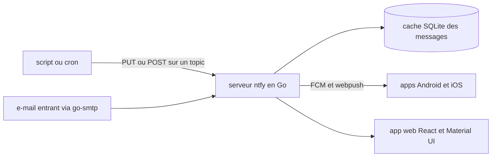

# binwiederhier/ntfy

> **Envoyer une notification sur son téléphone depuis un script, par simple requête HTTP.**

## Le problème

Prévenir un humain qu'un job a fini, qu'une sauvegarde a cassé ou qu'un entraînement a divergé
suppose d'ordinaire un compte chez un service de push, une clé, un SDK et une intégration mobile.
Sans cela, on se rabat sur l'e-mail, qu'on ne lit pas à temps.

## Ce que ça fait vraiment

ntfy est un service de notification pub-sub basé sur HTTP. On publie un message sur un *topic*
via PUT/POST, et tout abonné à ce topic le reçoit : application Android, application iOS, ou
application web. Le README insiste sur deux points : pas d'inscription et pas de frais pour la
version libre, et le service est open source donc auto-hébergeable. Le code serveur est en Go,
l'application web en React avec Material UI ; la persistance du cache de messages passe par
SQLite, l'envoi vers les mobiles par Firebase Cloud Messaging et webpush-go, et un serveur SMTP
embarqué (go-smtp) permet de recevoir des e-mails. Les applications mobiles vivent dans deux
dépôts séparés, `binwiederhier/ntfy-android` et `binwiederhier/ntfy-ios`.

## Comment c'est branché



Le serveur est l'unique pièce centrale : il reçoit les publications côté entrée, les conserve
dans un cache de messages persistant en SQLite, puis les pousse vers les abonnés. Le README ne
détaille aucun nom de fichier du code, seulement les briques tierces utilisées pour chacun de ces
rôles ; le découpage ci-dessus en est déduit et rien de plus.

## Essayer

```bash
# Le README ne contient aucune commande copiable : les captures d'écran montrent un appel curl,
# mais son texte n'est pas dans le README. L'installation et l'API sont renvoyées vers
# https://ntfy.sh/docs/install/ et https://ntfy.sh/docs/publish/
```

Aucune commande documentée dans le README lui-même. Le service hébergé est accessible sur
ntfy.sh, et les applications mobiles via Google Play, F-Droid et l'App Store.

## Coût et pièges

La version publique de ntfy.sh est gratuite et sans inscription. Des offres payantes existent
« à partir de 5 $/mois » pour qui ne veut pas s'auto-héberger ou veut soutenir le projet : le
freemium est donc réel, avec une version gratuite forcément bridée quelque part — le README ne
dit pas où. Auto-hébergé, il faut assumer un serveur et, pour le push mobile, la dépendance à
Firebase Cloud Messaging, donc à un service tiers Google. Le projet est doublement licencié
Apache 2.0 et GPLv2 : la seconde branche est copyleft, à vérifier avant tout embarquement. Enfin,
le README est écrit à la première personne du singulier par Philipp C. Heckel — le bus factor est
visible à l'œil nu, malgré une communauté Discord/Matrix active.

## Ce que ce n'est pas

Ce n'est pas une messagerie ni un bus de messages applicatif : un topic ntfy n'est pas sécurisé
par défaut, quiconque connaît son nom peut publier ou lire sur l'instance publique — le README ne
documente aucun contrôle d'accès, il renvoie à la doc. Ce n'est pas non plus un système de
notification interne à ton infra : sur ntfy.sh, les messages transitent par une instance tierce.
Et ce n'est pas un client mobile : le dépôt contient le serveur et l'app web, les apps Android et
iOS sont dans d'autres dépôts.

## Alternatives

Aucune alternative comparable dans le catalogue : les voisins proposés (huggingface/smolagents,
gastownhall/gastown, HKUDS/OpenHarness, open-policy-agent/opa) relèvent de l'agentique ou de la
politique d'autorisation et ne couvrent pas la notification push. Le README ne cite aucun
concurrent, seulement ses propres clients mobiles ntfy-android et ntfy-ios.

## Pour toi

Pour un profil data/MLOps, c'est le chaînon manquant entre un cron, un DAG ou un job GPU et ton
téléphone : une ligne HTTP en fin de pipeline, sans clé ni SDK. À adopter pour l'alerting
personnel et les jobs longs ; à auto-héberger dès que le contenu des messages devient sensible.
