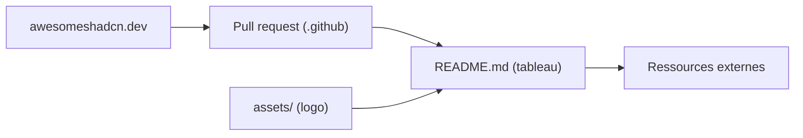

# birobirobiro/awesome-shadcn-ui

> Liste organisée de bibliothèques et composants autour de shadcn/ui, pour les développeurs React.

Note : le README n'a été lu qu'en partie (un tronçon du tableau n'a pas pu être chargé) ; cette fiche s'appuie sur le début et la fin du fichier.

## Le problème
L'écosystème shadcn/ui compte de très nombreuses briques tierces dispersées : il faut un catalogue daté pour s'y retrouver.

## Ce que ça fait vraiment
Un tableau alphabétique (nom, description, lien, date) de bibliothèques et composants : animations, calendriers, sélecteurs de dates, tableaux de données, glisser-déposer, chat IA, registres installables via la CLI shadcn. Parmi les entrées lues : `assistant-ui` (composants de chat IA), `localmode` (composants d'IA locale dans le navigateur), `agents-ui` (interfaces d'agents vocaux). Le dépôt comprend aussi un site avec formulaire de soumission.

## Comment c'est branché

## Essayer
Aucune commande documentée dans la partie lue. Le README indique de lire CONTRIBUTING.md avant de proposer une entrée, par formulaire ou par PR.

## Coût et pièges
Gratuit. Chaque entrée a sa propre licence et son propre niveau de maturité ; certaines proposent des offres payantes (mention explicite dans deux descriptions lues).

## Ce que ce n'est pas
Ce n'est pas une bibliothèque installable, mais un index. Il ne garantit ni la qualité ni la pérennité des liens.

## Alternatives
Aucune alternative citée dans la partie lue du README.

## Pour toi
Surveiller : utile à consulter quand tu construis une interface pour un outil IA en React, sans intérêt en dehors de ce besoin.

