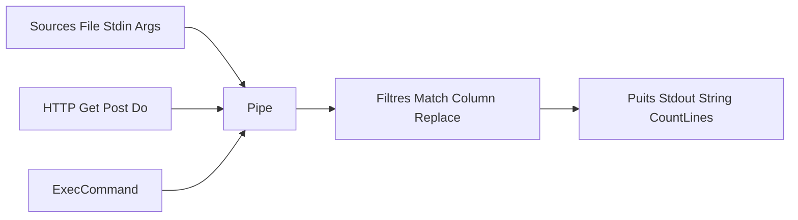

# bitfield/script

> Bibliothèque Go qui reproduit les pipelines de scripts shell (lecture, filtres, sous-processus) dans du Go typé.

## Le problème
Les scripts d'administration en shell sont fragiles ; en Go, lire un fichier, filtrer des lignes et lancer des commandes demande beaucoup de code.

## Ce que ce n'est pas mais : une API de chaînage `Source → Filtres → Puits`, exécutée en concurrence, qui mémorise l'erreur du premier étage défaillant.

## Ce que ça fait vraiment
Sources (`File`, `Stdin`, `Args`, `Get`, `ExecCommand`), filtres (`Match`, `Column`, `Replace`, `JQ`, `Freq`, `ExecForEach`, `Filter` sur mesure) et puits (`String`, `Stdout`, `CountLines`, `WriteFile`). Le README donne une table d'équivalents Unix et un exemple de comptage des visiteurs d'un log Apache en une ligne.

## Comment c'est branché


## Essayer
```go
import "github.com/bitfield/script"

numErrors, err := script.File("test.txt").Match("Error").CountLines()
script.Stdin().Column(1).Freq().First(10).Stdout()
```

## Coût et pièges
Gratuit. Les filtres tournent en concurrence : appeler `Wait` pour attendre la fin. Les réponses HTTP hors 200–299 sont traitées comme des erreurs.

## Ce que ce n'est pas
Pas un interpréteur shell : pas de pipe entre processus arbitraires hors de son API. Un interpréteur `go-script` externe est mentionné.

## Alternatives
`go-script` (interpréteur bash de Simon Willison) pour lancer des one-liners sans compiler.

## Pour toi
À surveiller : utile seulement si tu écris déjà des outils en Go ; sinon ton shell ou Python suffisent.

