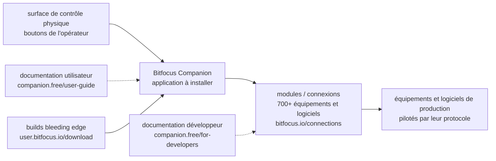

# bitfocus/companion

> **A control-surface application for driving live production gear from physical buttons.**

## The problem

A video or audio control room stacks up machines that each speak their own protocol and ship
their own application: switcher, player, streaming software, lighting desk. Without a shared
command layer, the operator juggles interfaces, and firing an action from a physical button
means writing the dialogue with every device yourself.

## What it actually does

The README is almost entirely a directory of links: it does not describe how the software works
and simply points to the user documentation, the developer documentation and the project
websites. Its only direct claim sits in the "Modules (Supported devices/software)" section: the
project publishes a catalogue of more than 700 connections to supported devices and software, at
`bitfocus.io/connections`.

The rest is traceable but indirect: Companion is open-source software (the README says so),
written in TypeScript according to the watch catalogue, distributed as downloadable builds, with
a separate "bleeding edge" build channel alongside stable releases. Bug reports go through the
repository's GitHub issue tracker, questions through a Slack channel, and funding through Open
Collective (backers and sponsors are listed in the README).

Anything more precise — how a button maps to an action, what a module looks like, how a control
surface is configured — is **not documented in this README** and lives behind the links to the
user and developer documentation.

## How it is wired



No code-derived diagram exists for this repository: this sketch is rebuilt from the README alone
and therefore names no real file in the repository. It does not say how Companion talks to the
modules — neither does the README.

## Trying it

```
No installation or launch command is documented in the README.
```

The README points to an installation page (user documentation, "getting started" guide, marked
beta) and to a build download page (`https://user.bitfocus.io/download`). Nothing is
reconstructed here: no `npm`, no `docker`, no startup script is quoted in the file that was read.

## Cost and pitfalls

- **Undeclared licence**: the catalogue reports `NOASSERTION`, meaning GitHub could not identify
  the licence file, and the README mentions no licence at all — only "open-source software".
  Clear this up against the repository before any professional use or redistribution.
- **Uninformative README**: it documents no prerequisites, no supported operating system, no
  required hardware. The real cost of entry (a physical control surface to buy, a dedicated
  machine in the control room) cannot be estimated from this source.
- **User documentation in beta**: the installation link points to a guide flagged `beta`, which
  suggests documentation under rewrite.
- **"Bleeding edge" builds behind an account**: downloads go through `user.bitfocus.io`, a user
  area; the README does not say whether an account is required.
- **Free but donation-funded**: Open Collective, backers and sponsors. Nothing indicates a
  support contract.

## What it is not

- **It is not a library or an SDK to import**: it is an application to install, aimed at an
  operator standing in front of a button surface, not a component to embed in code.
- **It is not the module catalogue**: the 700+ connections are listed on an external site and,
  judging by the developer documentation referenced, are developed separately. The repository
  read here is the application, not the set of integrations.
- **It is not a project documented in its own README**: anyone wanting to understand the product
  has to leave the repository. Judging the project on this file alone would be judging a
  directory of links.
- **Nothing in the README connects it to data, AI or MLOps.**

## Alternatives

No comparable alternative in the catalogue: the batch entry lists no authorised neighbours for
this repository, and the README names no other project — only websites, a Slack channel and the
project's own Open Collective page. There is therefore no name that could be offered here
without inventing it.

## For you

Worth watching from a distance, not adopting: for a data / AI / MLOps profile this is a live
production control tool with no point of contact with data or model pipelines. The only
transferable idea is the ecosystem shape — a host application plus several hundred separately
maintained integration modules — but the README documents too little to take anything from it.
