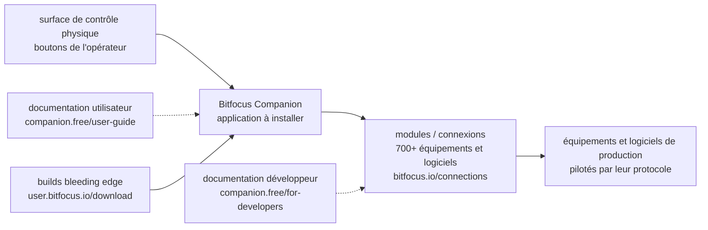

# bitfocus/companion

> **Logiciel de surface de contrôle pour piloter des équipements de production audiovisuelle depuis des boutons.**

## Le problème

Une régie vidéo ou audio empile des machines qui se pilotent chacune par son protocole et sa
propre application : mélangeur, lecteur, logiciel de diffusion, éclairage. Sans couche de
commande commune, l'opérateur jongle entre les interfaces, et déclencher une action sur un
bouton physique demande d'écrire soi-même le dialogue avec chaque appareil.

## Ce que ça fait vraiment

Le README est presque entièrement un annuaire de liens : il ne décrit pas le fonctionnement du
logiciel et se contente de renvoyer vers la documentation utilisateur, la documentation
développeur et les sites du projet. Ce qu'il affirme directement tient en une ligne de la
section « Modules (Supported devices/software) » : le projet publie un catalogue de plus de 700
connexions vers des équipements et logiciels pris en charge, publié sur
`bitfocus.io/connections`.

Le reste est traçable, mais indirect : Companion est un logiciel libre (« open-source software »
selon le README), écrit en TypeScript d'après le catalogue de veille, distribué sous forme de
builds téléchargeables, avec un canal de builds « bleeding edge » séparé des versions stables.
Le suivi des bugs passe par le système d'issues GitHub du dépôt, les questions par un canal
Slack, et le financement par Open Collective (donateurs et sponsors listés dans le README).

Toute description plus précise — comment un bouton est associé à une action, quel est le format
d'un module, comment se configure une surface de contrôle — n'est **pas documentée dans ce
README** et se trouve derrière les liens vers la documentation utilisateur et développeur.

## Comment c'est branché



Aucun diagramme tiré du code n'existe pour ce dépôt : ce schéma est reconstruit depuis le seul
README, et ne nomme donc aucun fichier réel du dépôt. Il ne dit pas comment Companion parle aux
modules — le README ne le dit pas non plus.

## Essayer

```
Aucune commande d'installation ou de lancement n'est documentée dans le README.
```

Le README renvoie vers une page d'installation (documentation utilisateur, guide « getting
started », en version bêta) et vers une page de téléchargement de builds
(`https://user.bitfocus.io/download`). Rien n'est reconstruit ici : il n'y a ni `npm`, ni
`docker`, ni script de démarrage cité dans le fichier lu.

## Coût et pièges

- **Licence non déclarée** : le catalogue relève `NOASSERTION`, c'est-à-dire que GitHub n'a pas
  su identifier le fichier de licence, et le README ne mentionne aucune licence — seulement
  « open-source software ». À lever sur le dépôt avant tout usage professionnel ou toute
  redistribution.
- **README non informatif** : il ne documente ni prérequis, ni système d'exploitation pris en
  charge, ni matériel nécessaire. Le coût réel d'entrée (surface de contrôle physique à acheter,
  machine dédiée en régie) n'est pas chiffrable à partir de cette source.
- **Documentation utilisateur en bêta** : le lien d'installation pointe vers un guide marqué
  `beta`, ce qui laisse supposer une documentation en cours de réécriture.
- **Builds « bleeding edge » derrière un compte** : le téléchargement passe par `user.bitfocus.io`,
  un espace utilisateur ; le README ne dit pas si un compte y est nécessaire.
- **Gratuit mais financé par dons** : Open Collective, backers et sponsors. Rien n'indique un
  contrat de support.

## Ce que ce n'est pas

- **Ce n'est pas une bibliothèque ni un SDK à importer** : c'est une application à installer,
  destinée à un opérateur devant une surface de boutons, pas un composant à intégrer dans du code.
- **Ce n'est pas le catalogue de modules** : les 700+ connexions sont listées sur un site
  externe et, d'après la documentation développeur évoquée, se développent séparément. Le dépôt
  lu ici est l'application, pas l'ensemble des intégrations.
- **Ce n'est pas un projet documenté dans son README** : quiconque veut comprendre le produit
  devra sortir du dépôt. Juger le projet sur ce fichier seul reviendrait à juger un annuaire.
- **Rien dans le README ne le rattache à la data, à l'IA ou au MLOps.**

## Alternatives

Aucune alternative comparable dans le catalogue : la ligne du lot ne propose aucun voisin
autorisé pour ce dépôt, et le README ne nomme aucun autre projet — uniquement des sites, un
canal Slack et une page Open Collective du projet lui-même. Il n'y a donc aucun nom qu'on
puisse proposer ici sans l'inventer.

## Pour toi

À surveiller de loin, pas à adopter : pour un profil data / IA / MLOps, c'est un outil de régie
audiovisuelle sans point de contact avec les chaînes de traitement de données ou de modèles. Le
seul intérêt transférable serait le modèle d'écosystème — une application hôte et plusieurs
centaines de modules d'intégration maintenus à part — mais le README n'en documente pas assez
pour en tirer quoi que ce soit.
