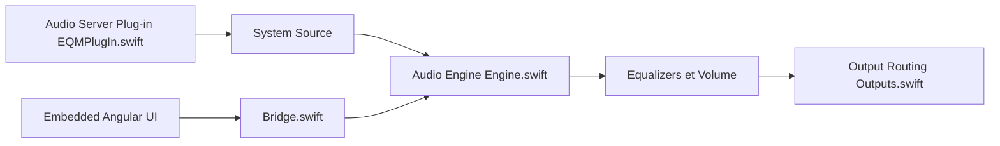

# bitgapp/eqMac

> Égaliseur audio système pour macOS, dont le code ouvert ne correspond qu'à la version 1.3.2 sans fonctions Pro.

## Le problème
macOS n'a pas d'égaliseur ni de gain de volume au niveau système.

## Ce que ça fait vraiment
Un pilote CoreAudio en espace utilisateur capture l'audio système, l'application Swift applique volume, boost, balance et égaliseurs (basique, 10 bandes), puis route vers la sortie choisie. L'interface Angular est embarquée et prévue pour des mises à jour à distance. Le README annonce en plus des fonctions Pro (égaliseur illimité, analyseur de spectre, mixeur par application) absentes de ce dépôt.

## Comment c'est branché

## Essayer
Aucune commande documentée dans le README.

## Coût et pièges
Le dépôt est figé sur la v1.3.2 ; les versions récentes sont sur un fork privé, avec fonctions Pro payantes.

## Ce que ce n'est pas
Pas la version actuelle de l'application ni l'intégralité de ses fonctions.

## Alternatives
Aucune alternative nommée dans le README.

## Pour toi
À ignorer : utilitaire audio macOS dont le code ouvert est une version ancienne, sans lien avec data/IA/MLOps.

