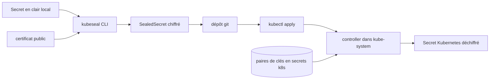

# bitnami-labs/sealed-secrets

> **Encrypts Kubernetes Secrets so they can live in git, even a public repository.**

## The problem

A cluster's whole configuration can be kept in git — except `Secret` objects, which are only
base64 and readable by anyone with the file. Without a tool for this, passwords travel through
a side channel next to the repository: copied by hand, never reviewed, never versioned.

## What it actually does

The project has two parts: a cluster-side controller/operator and a client-side utility,
`kubeseal`. `kubeseal` uses asymmetric crypto to encrypt a `Secret` into a `SealedSecret`
custom resource (`apiVersion: bitnami.com/v1alpha1`) that only the controller in the target
cluster can decrypt — not even the original author. A few seconds after the apply, the
controller unseals it into a normal Kubernetes `Secret`, which becomes a dependent object of
the `SealedSecret` (updated and deleted with it, unless the `skip-set-owner-references`
annotation is set). The controller keeps a set of key pairs stored as ordinary k8s secrets,
labelled `active` or `compromised`, and since v0.9.x certificates are renewed automatically
every 30 days. A `template` block describes the labels, annotations, `type` and `immutable`
fields of the produced `Secret`, with the Sprig function library available (except `env`,
`expandenv` and `getHostByName`).

## How it is wired



The README describes this path in two halves. On the workstation, `kubeseal` needs the public
certificate: it fetches it from the controller at runtime through the API server, or offline
via `kubeseal --fetch-cert >mycert.pem` then `--cert mycert.pem`, or from a URL, or from the
`SEALED_SECRETS_CERT` environment variable. In the cluster, the controller loads the key
registry at startup, creates a new key, starts the rotation cycle, then watches `SealedSecret`
resources — across all namespaces by default (`--all-namespaces`, which defaults to true),
restrictable with `--additional-namespaces` or `--all-namespaces=false`. Name and namespace are
folded into the encryption: `strict` scope by default, otherwise `namespace-wide` or
`cluster-wide` via `--scope`.

## Trying it

```bash
brew install kubeseal
```

```bash
helm repo add sealed-secrets https://bitnami.github.io/sealed-secrets
helm install sealed-secrets -n kube-system --set-string fullnameOverride=sealed-secrets-controller sealed-secrets/sealed-secrets
```

```bash
# Create a json/yaml-encoded Secret somehow:
# (note use of `--dry-run` - this is just a local file!)
echo -n bar | kubectl create secret generic mysecret --dry-run=client --from-file=foo=/dev/stdin -o json >mysecret.json

# This is the important bit:
kubeseal -f mysecret.json -w mysealedsecret.json

# Eventually:
kubectl create -f mysealedsecret.json

# Profit!
kubectl get secret mysecret
```

On Linux the README also documents installing from a release tarball
(`curl -OL .../kubeseal-${KUBESEAL_VERSION}-linux-amd64.tar.gz` then
`sudo install -m 755 kubeseal /usr/local/bin/kubeseal`) and from source with
`go install github.com/bitnami/sealed-secrets/cmd/kubeseal@main`.

## Cost and traps

Free, no account and no API key: you need a Kubernetes cluster (versions above 1.16
"typically compatible", CI-verified above 1.24) and the rights to deploy into it. The README
states that only the latest version is supported for production. Documented traps: the Helm
chart installs the controller as `sealed-secrets` while the CLI looks for
`sealed-secrets-controller` in `kube-system`, hence `--controller-name` or `fullnameOverride`;
fetching the certificate through the API server is described as brittle on clusters with
special configurations such as firewalled private GKE clusters; old keys are not garbage
collected automatically; and the controller does not pick up manually created, deleted or
relabelled sealing keys until an admin restarts it. Finally, no license is declared in the
metadata available here, which is worth checking before any corporate use.

## What it is not

It is not a secret vault and not a password rotation manager: the README is explicit that
sealing key renewal is **not a substitute** for rotating your actual secrets, and that anything
committed to a public repository must be assumed permanently exposed if the key ever leaks.
It is not an authentication mechanism either — "by design, this scheme does not authenticate
the user", so anyone can craft a `SealedSecret` for a given name/namespace pair, and it is up
to your config management workflow and cluster RBAC to control what actually gets applied.
Decryption does not happen client-side: without access to the cluster or a backup of the
private key, nothing comes back. Raw mode is flagged experimental, and offloading encryption
to HSM or managed cloud KMS is announced as work in progress, not as a feature.

## Alternatives

The README names no competitor, only a constellation of satellite projects: `kseal`
(eznix86/kseal) and `kubeseal-convert` (EladLeev/kubeseal-convert) to smooth the CLI
experience, WebSeal (socialgouv/webseal) to seal secrets in the browser, and a Visual Studio
Code extension. Among the supplied neighbours none covers the same job: aquasecurity/trivy
scans for vulnerabilities and leaked secrets rather than encrypting them, and
authelia/authelia does authentication. No genuinely comparable alternative in the catalogue.

## For you

If your ML workloads are deployed on Kubernetes through GitOps, this is the piece that lets
object store, registry or tracking server credentials live in the same repository as the rest,
with no extra secret server to operate. Worth adopting, bearing in mind that the controller
becomes a critical point: losing the sealing keys means losing every secret in the cluster.
