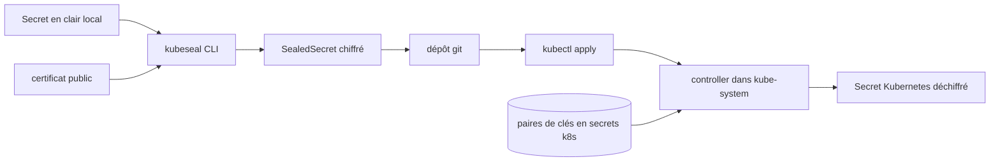

# bitnami-labs/sealed-secrets

> **Chiffre les Secrets Kubernetes pour qu'ils tiennent dans git, y compris un dépôt public.**

## Le problème

Toute la configuration d'un cluster Kubernetes peut vivre dans git — sauf les `Secret`, qui ne
sont que du base64 et se lisent en clair. Sans outil, on maintient à côté du dépôt un canal
parallèle pour les mots de passe, avec les dérives que ça implique : secrets copiés à la main,
jamais revus, jamais versionnés.

## Ce que ça fait vraiment

Le projet se compose de deux morceaux : un contrôleur/opérateur côté cluster et un utilitaire
client, `kubeseal`. `kubeseal` chiffre un `Secret` en cryptographie asymétrique dans une
ressource personnalisée `SealedSecret` (`apiVersion: bitnami.com/v1alpha1`), que seul le
contrôleur du cluster cible peut déchiffrer — pas même l'auteur d'origine. Le contrôleur
déchiffre et produit le `Secret` Kubernetes correspondant quelques secondes après l'apply ; le
`Secret` devient un objet dépendant du `SealedSecret` (mis à jour et supprimé avec lui, sauf
annotation `skip-set-owner-references`). Le contrôleur maintient un jeu de paires de clés
stockées comme secrets k8s, étiquetées `active` ou `compromised`, et renouvelle
automatiquement les certificats tous les 30 jours depuis la v0.9.x. Un bloc `template` permet
de décrire les labels, annotations, `type` et `immutable` du `Secret` produit, avec la
bibliothèque Sprig (sauf `env`, `expandenv` et `getHostByName`).

## Comment c'est branché



Le README décrit ce chemin en deux temps. Côté poste de travail, `kubeseal` a besoin de la
partie publique du certificat : il la récupère à la volée auprès du contrôleur via l'API
server, ou hors ligne avec `kubeseal --fetch-cert >mycert.pem` puis `--cert mycert.pem`, ou
encore par URL ou via la variable `SEALED_SECRETS_CERT`. Côté cluster, le contrôleur lit le
registre de clés au démarrage, en crée une nouvelle, démarre le cycle de rotation, puis
surveille les `SealedSecret` — par défaut sur tous les namespaces (`--all-namespaces`, vrai
par défaut), restreignable via `--additional-namespaces` ou `--all-namespaces=false`. Le nom
et le namespace sont inclus dans le chiffrement (portée `strict` par défaut, sinon
`namespace-wide` ou `cluster-wide` via `--scope`).

## Essayer

```bash
brew install kubeseal
```

```bash
helm repo add sealed-secrets https://bitnami.github.io/sealed-secrets
helm install sealed-secrets -n kube-system --set-string fullnameOverride=sealed-secrets-controller sealed-secrets/sealed-secrets
```

```bash
# Create a json/yaml-encoded Secret somehow:
# (note use of `--dry-run` - this is just a local file!)
echo -n bar | kubectl create secret generic mysecret --dry-run=client --from-file=foo=/dev/stdin -o json >mysecret.json

# This is the important bit:
kubeseal -f mysecret.json -w mysealedsecret.json

# Eventually:
kubectl create -f mysealedsecret.json

# Profit!
kubectl get secret mysecret
```

Sur Linux, le README documente aussi une installation par archive de release
(`curl -OL .../kubeseal-${KUBESEAL_VERSION}-linux-amd64.tar.gz` puis
`sudo install -m 755 kubeseal /usr/local/bin/kubeseal`) et depuis les sources avec
`go install github.com/bitnami/sealed-secrets/cmd/kubeseal@main`.

## Coût et pièges

Gratuit, pas de compte ni de clé d'API : il faut un cluster Kubernetes (versions au-delà de
1.16 « typiquement compatibles », vérification CI au-delà de 1.24) et le droit d'y déployer.
Le README prévient que seule la dernière version est supportée en production. Pièges
documentés : le chart Helm nomme le contrôleur `sealed-secrets` alors que la CLI cherche
`sealed-secrets-controller` dans `kube-system`, d'où `--controller-name` ou
`fullnameOverride` ; la récupération du certificat via l'API server est « connue pour être
fragile » sur les clusters à configuration particulière, comme les clusters GKE privés
pare-feutés ; les vieilles clés ne sont pas ramassées automatiquement ; le contrôleur ne
détecte pas les clés de scellement créées, supprimées ou réétiquetées à la main sans
redémarrage. Enfin, la licence n'est pas déclarée dans les métadonnées dont on dispose, ce
qui est à vérifier avant tout usage en entreprise.

## Ce que ce n'est pas

Ce n'est pas un coffre-fort de secrets ni un gestionnaire de rotation des mots de passe : le
README insiste sur le fait que le renouvellement de la clé de scellement n'est **pas un
substitut** à la rotation de vos vrais secrets, et qu'un secret publié dans un dépôt public
doit être considéré comme définitivement exposé si la clé fuit. Ce n'est pas non plus un
mécanisme d'authentification : « par construction, ce schéma n'authentifie pas
l'utilisateur » — n'importe qui peut fabriquer un `SealedSecret` pour un couple nom/namespace
donné, c'est à votre workflow de configuration et au RBAC de contrôler ce qui est appliqué.
Enfin, le déchiffrement ne se fait pas côté client : sans accès au cluster ou à une sauvegarde
de la clé privée, on ne récupère rien. Le mode `--raw` est explicitement marqué expérimental,
et l'offload vers HSM ou KMS est annoncé comme un chantier, pas comme une fonctionnalité.

## Alternatives

Le README ne cite pas de concurrent mais une constellation de projets satellites :
`kseal` (eznix86/kseal) et `kubeseal-convert` (EladLeev/kubeseal-convert) pour améliorer
l'ergonomie de la CLI, WebSeal (socialgouv/webseal) pour sceller depuis le navigateur, et une
extension Visual Studio Code. Parmi les voisins fournis, aucun ne couvre la même fonction :
aquasecurity/trivy scanne les vulnérabilités et les secrets exposés plutôt qu'il ne les
chiffre, et authelia/authelia fait de l'authentification. Aucune alternative réellement
comparable dans le catalogue.

## Pour toi

Si tes déploiements ML vivent sur Kubernetes en GitOps, c'est la brique qui te permet de
mettre les credentials de ton object store, de ton registry ou de ton tracking server dans le
même dépôt que le reste — sans serveur de secrets supplémentaire à opérer. À adopter, en
gardant en tête que le contrôleur devient un point critique : perdre ses clés de scellement,
c'est perdre tous les secrets du cluster.
