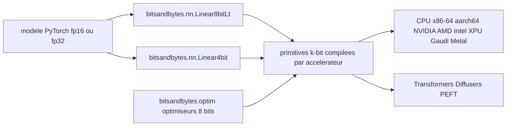

# bitsandbytes-foundation/bitsandbytes

> **k-bit quantization for PyTorch: fit LLM inference and fine-tuning into far less memory.**

## The problem

Without it, a model held in 16- or 32-bit weights saturates the machine's memory: inference
does not fit, and training fits even less. Optimizer states alone weigh as much as the
weights, which puts fine-tuning out of reach on ordinary hardware.

## What it actually does

Three building blocks, as the README states them. 8-bit optimizers using block-wise
quantization, claimed to keep 32-bit behaviour at a fraction of the memory cost. LLM.int8(),
vector-wise 8-bit quantization that handles outliers separately in 16-bit matrix
multiplication, halving inference memory. QLoRA, 4-bit quantization of the model plus a small
set of trainable low-rank adaptation weights. All of it is exposed as PyTorch primitives:
`bitsandbytes.nn.Linear8bitLt`, `bitsandbytes.nn.Linear4bit` and the `bitsandbytes.optim`
module. It is not a training framework: these are layers and optimizers you swap into an
existing model.

## How it is wired



You replace the model's linear layers with `Linear8bitLt` or `Linear4bit`, and the optimizer
with its 8-bit counterpart from `bitsandbytes.optim`. These call into k-bit primitives whose
availability the README details per platform and accelerator. Upstream, the Hugging Face
libraries (Transformers, Diffusers, PEFT) each document their own integration, which is the
most common way in.

## Trying it

```bash
# The README documents no installation or usage command.
# It points to the official documentation (huggingface.co/docs/bitsandbytes/main)
# and to the Transformers, Diffusers and PEFT guides.
```

The project ships on PyPI (per the "PyPI - Python Version" badge), but no command line is
written out in the README, and none is reconstructed here.

## Cost and traps

Free, MIT, no API key and no third-party service. The real prerequisites are hardware and
software: Python 3.10+, PyTorch 2.4+, and an accelerator from the table. That is where the
trap sits: support is not uniform. The README's table describes the development branch, not
the latest stable release (it links to the 0.50.0 tag for that). 8-bit optimizers are marked
unsupported on Intel Gaudi and only planned on Metal, and several LLM.int8() cells carry an
asterisk flagging missing performance optimizations. Check your platform/accelerator pair
before committing.

## What it is not

It is not an inference server nor a fine-tuning framework: nothing here serves a model or
drives a training loop, you still need PyTorch and, in practice, the Hugging Face stack
around it. It is not a speed guarantee either: the stated goal is memory, and the README
explicitly flags paths that work but are not optimized. Finally, quantization is not free in
quality terms in the abstract — the README asserts no degradation for LLM.int8() and QLoRA,
which remains the project's claim, not something this sheet can verify.

## Alternatives

The README names no competitor, only integrations. From the catalogue neighbours:
hiyouga/LlamaFactory if you want a full fine-tuning framework rather than primitives to swap
in yourself; Blaizzy/mlx-vlm if the target is Apple Silicon only, where bitsandbytes' Metal
support is still partial; NVIDIA-NeMo/Automodel inside an end-to-end NVIDIA environment.

## For you

This is a foundation dependency of the open-source LLM stack: if you do QLoRA fine-tuning or
quantized inference, you already use it, often without knowing, through Transformers or PEFT.
Foundation governance, Hugging Face sponsorship, MIT licence, nightly tests: little reason for
distrust. Worth knowing so you can read quantization errors correctly and pick your
accelerator deliberately.
