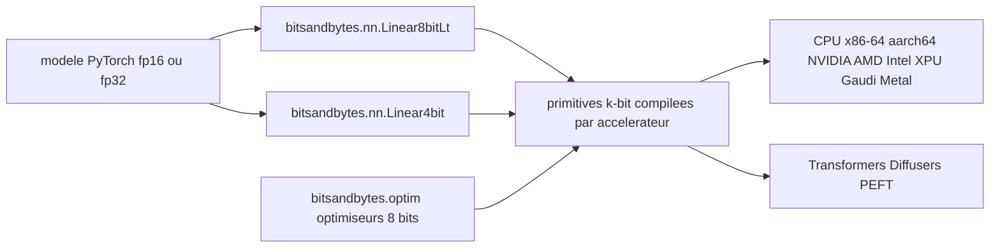

# bitsandbytes-foundation/bitsandbytes

> **Quantification k-bit pour PyTorch : faire tenir inférence et fine-tuning de LLM en moins de mémoire.**

## Le problème

Sans elle, un LLM chargé en 16 ou 32 bits sature la mémoire de la machine : l'inférence
ne passe pas, et l'entraînement encore moins. Les états de l'optimiseur pèsent à eux seuls
autant que les poids, ce qui rend le fine-tuning inaccessible hors gros matériel.

## Ce que ça fait vraiment

Trois briques, annoncées comme telles par le README. Des optimiseurs 8 bits à quantification
par blocs, censés conserver le comportement du 32 bits pour une fraction de la mémoire.
LLM.int8(), quantification 8 bits vectorielle qui traite à part les valeurs aberrantes en
multiplication matricielle 16 bits, pour diviser par deux la mémoire d'inférence. QLoRA,
quantification 4 bits du modèle plus un petit jeu de poids LoRA entraînables. Le tout est
exposé comme des primitives PyTorch : `bitsandbytes.nn.Linear8bitLt`, `bitsandbytes.nn.Linear4bit`
et le module `bitsandbytes.optim`. Ce n'est pas un framework d'entraînement : ce sont des
couches et des optimiseurs qu'on substitue dans un modèle existant.

## Comment c'est branché



On remplace les couches linéaires du modèle par `Linear8bitLt` ou `Linear4bit`, et l'optimiseur
par son équivalent 8 bits de `bitsandbytes.optim`. Ces objets appellent des primitives k-bit
dont le README détaille la disponibilité par plateforme et par accélérateur. En amont, les
bibliothèques Hugging Face (Transformers, Diffusers, PEFT) documentent chacune leur propre
intégration, ce qui est le chemin d'usage le plus courant.

## Essayer

```bash
# Le README ne documente aucune commande d'installation ni d'usage.
# Il renvoie à la documentation officielle (huggingface.co/docs/bitsandbytes/main)
# et aux guides Transformers, Diffusers et PEFT.
```

Le dépôt publie sur PyPI (badge « PyPI - Python Version » dans le README), mais aucune ligne
de commande n'est écrite noir sur blanc : rien n'est reconstruit ici.

## Coût et pièges

Gratuit, MIT, pas de clé d'API ni de service tiers. Les vrais prérequis sont matériels et
logiciels : Python 3.10+, PyTorch 2.4+, et un accélérateur listé dans le tableau. Le piège
est là : le support n'est pas uniforme. Le tableau du README décrit la branche de
développement, pas la dernière version stable (il renvoie au tag 0.50.0 pour celle-ci). Les
optimiseurs 8 bits sont marqués non supportés sur Intel Gaudi et seulement planifiés sur
Metal, et plusieurs cases LLM.int8() portent une étoile signalant l'absence d'optimisation
de performance. Vérifier sa combinaison plateforme/accélérateur avant de s'engager.

## Ce que ce n'est pas

Ce n'est pas un moteur d'inférence ni un framework de fine-tuning : rien ici ne sert un
modèle ni ne pilote une boucle d'entraînement, il faut PyTorch et, en pratique, la pile
Hugging Face autour. Ce n'est pas non plus une garantie de gain en vitesse : le propos est la
mémoire, et le README signale explicitement des chemins fonctionnels mais non optimisés. Enfin
la quantification n'est pas gratuite en qualité dans l'absolu — le README affirme l'absence de
dégradation pour LLM.int8() et QLoRA, ce qui reste une affirmation du projet, pas une mesure
que la fiche peut vérifier.

## Alternatives

Le README ne nomme aucun concurrent, seulement des intégrations. Parmi les voisins du
catalogue : hiyouga/LlamaFactory si l'on cherche un framework de fine-tuning complet plutôt
que des primitives à substituer soi-même ; Blaizzy/mlx-vlm si la cible est exclusivement
Apple Silicon, où le support Metal de bitsandbytes reste partiel ;
NVIDIA-NeMo/Automodel dans un environnement NVIDIA intégré de bout en bout.

## Pour toi

C'est une dépendance de fond de la pile LLM open source : si tu fais du fine-tuning QLoRA ou
de l'inférence quantifiée, tu l'utilises déjà, souvent sans le savoir, via Transformers ou
PEFT. Gouvernance en fondation, sponsor Hugging Face, licence MIT, tests nocturnes : peu de
raisons de s'en méfier. À connaître pour lire correctement les erreurs de quantification et
choisir son accélérateur en connaissance de cause.
