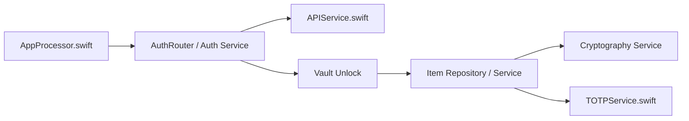

# bitwarden/ios

> Code source des apps iOS Bitwarden (gestionnaire de mots de passe) et Authenticator.

## Le problème
Garder ses mots de passe et codes TOTP chiffrés et synchronisés sur iPhone, avec saisie automatique.

## Ce que ça fait vraiment
Le README ne détaille pas les fonctions : il renvoie à la documentation de contribution et présente les projets liés (serveur, clients, directory-connector). D'après le code : orchestration de l'app, authentification, déverrouillage du coffre, chiffrement, TOTP, import/export, saisie automatique, extensions Action et Share, synchronisation Watch, et l'app Authenticator avec stockage chiffré.

## Comment c'est branché

## Essayer
Le README ne donne pas de commande : le guide de build iOS est dans la documentation de contribution externe.

## Coût et pièges
Un compte Bitwarden et le serveur (hébergé ou auto-hébergé) sont nécessaires. Compilation par Xcode. Le dépôt compte 135 issues ouvertes.

## Ce que ce n'est pas
Ce n'est pas le serveur ni les clients bureau/web (autres dépôts). Le README est court et renvoie à l'extérieur.

## Alternatives
- bitwarden/server : le backend.
- bitwarden/clients : clients non mobiles.

## Pour toi
À ignorer : app mobile de gestion de mots de passe, sans rapport avec un travail data/IA/MLOps.

