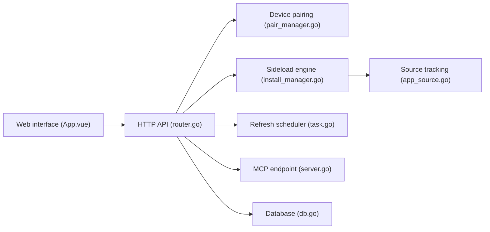

# bitxeno/atvloadly

> Service web pour installer et rafraîchir des apps sur Apple TV par sideloading, sous Linux ou OpenWrt.

## Le problème
Installer hors App Store une app IPA sur Apple TV expire vite avec un compte gratuit et demande une machine Apple.

## Ce que ça fait vraiment
Service Go avec interface Vue : découverte et appairage de l'Apple TV, installation d'un IPA via Impactor (cœur de sideloading), rafraîchissement automatique planifié, plusieurs comptes Apple ID, suivi de sources (releases GitHub, sources AltStore). Il expose `/healthcheck` et un point d'accès `/mcp` pour qu'un agent installe ou rafraîchisse des apps.

## Comment c'est branché


## Essayer
```bash
docker run --security-opt seccomp:unconfined -d --name=atvloadly --restart=always -p 5533:80 -v /path/to/mount/dir:/data -v /var/run/dbus:/var/run/dbus -v /var/run/avahi-daemon:/var/run/avahi-daemon bitxeno/atvloadly:latest
```
(`avahi-daemon` doit être installé sur l'hôte.)

## Coût et pièges
Gratuit. Le README recommande un Apple ID jetable (« burned account ») et un téléphone pour le 2FA ; risques de gel de compte reconnus. Compte gratuit : 3 apps actives maximum.

## Ce que ce n'est pas
Ne fonctionne ni sous Mac ni sous Windows. Une mise à jour du système Apple TV impose un nouvel appairage ; les IPA exigeant CloudKit plantent avec un compte gratuit.

## Alternatives
Aucune alternative nommée dans le README.

## Pour toi
À ignorer : utilitaire de divertissement sans lien avec data/IA/MLOps, avec un risque sur ton compte Apple.

