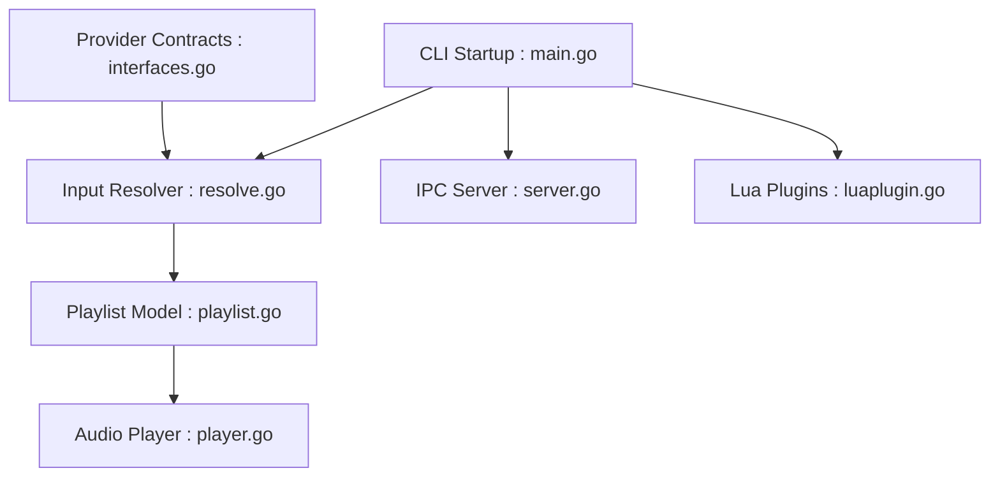

# bjarneo/cliamp

> Lecteur de musique rétro en terminal inspiré de Winamp, avec de nombreuses sources locales et distantes.

## Le problème
Écouter fichiers, radios, podcasts et services de streaming depuis un terminal.

## Ce que ça fait vraiment
Lecteur Go (Bubbletea) avec visualiseur de spectre, égaliseur paramétrique et gestionnaire de playlists. Sources : fichiers, flux, podcasts, radio, YouTube via yt-dlp, Spotify via go-librespot, Navidrome, Plex, Jellyfin et d'autres. Contrôle à distance, plugins Lua et touches média.

## Comment c'est branché


## Essayer
```bash
brew install bjarneo/cliamp/cliamp
cliamp ~/Music
cliamp https://example.com/stream
cliamp setup
```

## Coût et pièges
Gratuit. ffmpeg et yt-dlp optionnels selon les formats. Sous Windows, Spotify demande CGO et MinGW pour compiler. L'installation par `curl | sh` est proposée : à lire avant d'exécuter. README apparemment tronqué en fin.

## Ce que ce n'est pas
Pas un outil de travail : un lecteur audio, sans lien avec data/IA.

## Alternatives
Aucune alternative nommée dans le README.

## Pour toi
À ignorer : agréable pour écouter de la musique en terminal, mais sans valeur pour un profil data/IA/MLOps.

