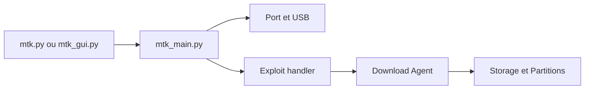

# bkerler/mtkclient

> Outil PC pour lire, écrire et déverrouiller la mémoire de téléphones MediaTek par USB, via des exploits du bootrom.

## Le problème
Sauvegarder, restaurer ou débloquer un appareil MediaTek exige un accès bas niveau que les outils constructeur ne donnent pas.

## Ce que ça fait vraiment
Un programme Python (CLI `mtk.py`, interface Qt `mtk_gui.py`, API et client/serveur TCP) qui détecte la puce, choisit un exploit (kamakiri, amonet, heapbait…) ou un préloader, envoie un download agent et lit ou écrit la flash et les partitions. Les puces récentes (protocole V6) exigent un loader adapté et le mode préloader.

## Comment c'est branché

## Essayer
Le README renvoie aux pages d'installation et d'usage sans les reproduire. Seule commande citée : lancer l'outil `mtk` avec `--debugmode` pour écrire `log.txt`.

## Coût et pièges
Windows : port MTK d'origine et driver USBDK ; Linux : noyau patché pour l'ancien kamakiri. Écrire dans la flash peut rendre l'appareil inutilisable ; à réserver à ton propre matériel.

## Ce que ce n'est pas
Ni un outil de sauvegarde grand public ni un utilitaire sans risque : il s'appuie sur des exploits.

## Alternatives
Aucune alternative nommée dans le README.

## Pour toi
Ignorer : outil de bas niveau sur appareils mobiles, GPL-3.0, sans usage dans un flux data ou MLOps.

