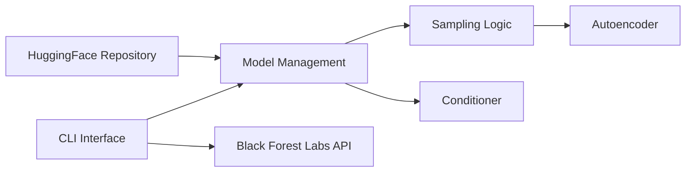

# black-forest-labs/flux

> Code d'inférence minimal des modèles open-weight FLUX pour générer et éditer des images.

## Le problème
Utiliser les poids FLUX localement demande un code de référence fiable pour la génération, l'inpainting et le conditionnement structurel.

## Ce que ça fait vraiment
CLI Python (`python -m flux ...`) et démos pour FLUX.1 schnell, dev, Fill, Canny, Depth, Redux, Kontext, Krea.
Poids sur Hugging Face ; autoencodeur sous Apache-2.0.
Suivi d'usage via l'API BFL (`--track_usage`) pour l'usage commercial des modèles dev.
Accès aux modèles Pro via API payante séparée.

## Comment c'est branché


## Essayer
```bash
cd $HOME && git clone https://github.com/black-forest-labs/flux
cd $HOME/flux
python3.10 -m venv .venv
source .venv/bin/activate
pip install -e ".[all]"
python -m flux kontext --track_usage --prompt "replace the logo with the text 'Black Forest Labs'"
```

## Coût et pièges
Code Apache-2.0 mais la plupart des poids « dev » sont non commerciaux : licence payante et reporting d'usage via clé `BFL_API_KEY`. GPU requis.

## Ce que ce n'est pas
Pas une application. Seul schnell est librement exploitable commercialement. Dernier push juillet 2025.

## Alternatives
Aucune alternative nommée dans le README.

## Pour toi
Surveiller : code de référence utile pour tester FLUX, mais les clauses commerciales des poids en font un piège pour tout usage client.
