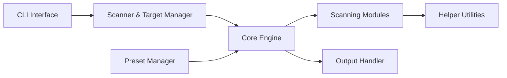

# blacklanternsecurity/bbot

> Scanner de reconnaissance modulaire pour cartographier la surface d'exposition d'un domaine, à l'usage des équipes sécurité.

## Le problème
Inventorier les sous-domaines, e-mails et services exposés d'une organisation demande d'enchaîner plusieurs outils.

## Ce que ça fait vraiment
Un moteur d'événements exécute des modules (DNS, web, e-mails, cloud, code) choisis via des presets YAML (`subdomain-enum`, `spider`, `web`, `kitchen-sink`…). Les cibles peuvent être des domaines, IP, plages, URL, organisations. Les résultats partent vers des modules de sortie (CSV, JSON, Neo4j, Postgres, Slack…). Utilisable aussi comme bibliothèque Python, synchrone ou asynchrone.

## Comment c'est branché


## Essayer
```bash
pipx install bbot
bbot -t evilcorp.com -p subdomain-enum
bbot -t evilcorp.com -p subdomain-enum -rf passive
```

## Coût et pièges
Gratuit ; des clés d'API tierces (SecurityTrails, VirusTotal…) enrichissent les résultats, à placer dans `~/.config/bbot/secrets.yml`. La version 3.0 casse la compatibilité avec la 2.x.

## Ce que ce n'est pas
Un outil à double usage : les presets « web-heavy » et « kitchen-sink » sont actifs et bruyants. À lancer uniquement sur des cibles dont on est propriétaire ou pour lesquelles on a un mandat (programme de bug bounty compris). Licence AGPL-3.0 : obligations de partage si exposé en service.

## Alternatives
- Spiderfoot : l'outil dont BBOT s'inspire.
- Amass : gère aussi des clés d'API tierces.
- Subfinder : idem, centré sous-domaines.

## Pour toi
À surveiller : intéressant pour inventorier ton propre périmètre cloud/API, mais l'AGPL et la nature offensive le réservent à un cadre sécurité explicite.

