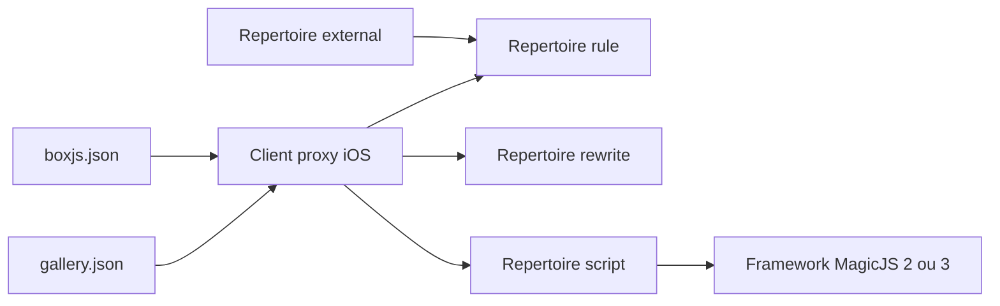

# blackmatrix7/ios_rule_script

> **A repository of traffic rules and automation scripts** for iOS proxy clients, aimed at Chinese-speaking Quantumult X users.

## The problem

Setting up a proxy client on iOS requires per-service traffic-splitting rules, rewrite rules
and automation scripts. Without a single place that gathers them, every user copies and
maintains their own lists by hand from sources scattered across the internet. The README
states it plainly: the project does not produce rules, it only carries them. What it fills is
a centralisation need, not an authoring one.

## What it actually does

The repository ships three families of content, each in its own directory: `rule/` for
traffic-splitting rules, `rewrite/` for rewrite rules and `script/` for automation scripts.
The scripts listed in the README target mainstream Chinese services: daily check-ins for
smzdm, Baidu Tieba, manmanbuy, dingdong, Fa米家, Luka and zheye, removal of cached app
startup ads, Synology Download Station offline downloading, and AppleStore stock monitoring
(marked as paused). All of them run on the MagicJS framework, version 2 or 3 depending on the
script. An `external/` directory mirrors resources taken from other open-source projects,
merely integrated and backed up here, with no support from the maintainer.

## How it is wired



The proxy client consumes the repository files straight from their raw URLs. Two index files
act as subscription entry points: `script/gallery.json`, declared as a Quantumult X Gallery,
and `script/boxjs.json`, contributed by @chouchoui for BoxJS. The scripts themselves depend on
MagicJS. The README documents no generation or auto-update mechanism for the rules.

## Trying it

```
No installation command is documented in the README.
The entry points are URLs to add inside the client:
https://raw.githubusercontent.com/blackmatrix7/ios_rule_script/master/script/gallery.json
https://raw.githubusercontent.com/blackmatrix7/ios_rule_script/master/script/boxjs.json
```

There is no command line and no package manager: you subscribe your proxy client to those
addresses, or point it at the files of the directory you need.

## Cost and traps

The repository is free but unusable on its own: it assumes a third-party proxy client
(Quantumult X is the only one named, with BoxJS as configuration manager), which is paid
software acquired separately. The README adds an unusual clause: anyone using the project is
asked to finish their "study and research" within 24 hours and then delete all of its content,
and any republication by media or public accounts is forbidden. The maintainer explicitly
disclaims any guarantee of legality, accuracy, completeness or effectiveness. For the
`external/` resources, no question will be answered: you must contact the original authors.
The declared licence is GPL-2.0, therefore copyleft. One table entry (AppleStore) is already
flagged as paused, which says a lot about how long a script survives the apps it targets.

## What it is not

This is not a library or a tool you install: nothing runs on a development machine, everything
is consumed by an iOS proxy client. It is not an original project either — the rules come from
the internet and from other open-source projects, and the repository openly takes the role of
a transit and backup store. Finally it is not documented in English: the README is entirely in
Chinese and the scripts target services reachable from mainland China, which sharply limits
its usefulness elsewhere.

## Alternatives

The README names no competing project, only contributors and aggregated external resources
without repository names, and no catalogue neighbours were supplied. No comparable alternative
in the catalogue.

## For you

Nothing here relates to a data / AI / MLOps profile: no model, no pipeline, no data tooling,
only mobile proxy configuration for an ecosystem of Chinese apps. The 27,908 stars measure an
iOS user community, not technical relevance in this context. Skip it, unless you personally
use the Quantumult X client.
