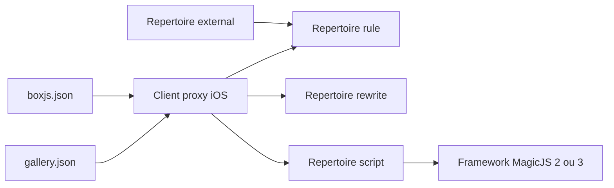

# blackmatrix7/ios_rule_script

> **Dépôt de règles de routage et de scripts** pour clients proxy iOS, destiné aux utilisateurs sinophones de Quantumult X.

## Le problème

Configurer un client proxy sur iOS demande des listes de règles de répartition du trafic par
service, plus des règles de réécriture et des scripts d'automatisation. Sans un dépôt qui les
agrège, chacun recopie et maintient ses propres listes à la main, dispersées sur Internet.
Le README le dit lui-même : « nous ne produisons pas les règles, nous ne faisons que les
transporter » — le besoin comblé est celui de la centralisation, pas de la création.

## Ce que ça fait vraiment

Le dépôt publie trois familles de contenus, chacune dans son répertoire : `rule/` pour les
règles de répartition du trafic, `rewrite/` pour les règles de réécriture, `script/` pour les
scripts d'automatisation. Les scripts listés dans le README visent des services chinois
grand public : signature quotidienne sur 什么值得买, 百度贴吧, 慢慢买, 叮咚买菜, Fa米家, Luka,
哲也同学, suppression d'écrans publicitaires de démarrage d'applications, téléchargement hors
ligne sur Synology, et surveillance de stock AppleStore (marquée « en pause »). Tous
s'appuient sur le framework MagicJS, en version 2 ou 3 selon le script. Un répertoire
`external/` reprend des ressources issues d'autres projets ouverts, simplement intégrées et
sauvegardées ici, sans support possible de la part du mainteneur.

## Comment c'est branché



Le client proxy consomme directement les fichiers du dépôt par leur URL brute. Deux fichiers
d'index servent de point d'entrée d'abonnement : `script/gallery.json`, déclaré comme
Quantumult X Gallery, et `script/boxjs.json`, contribué par @chouchoui pour BoxJS. Les
scripts eux-mêmes dépendent de MagicJS. Le README ne documente aucun mécanisme de génération
ou de mise à jour automatique des règles.

## Essayer

```
Aucune commande d'installation n'est documentée dans le README.
Les points d'entrée sont des URL à ajouter dans le client :
https://raw.githubusercontent.com/blackmatrix7/ios_rule_script/master/script/gallery.json
https://raw.githubusercontent.com/blackmatrix7/ios_rule_script/master/script/boxjs.json
```

Il n'y a ni ligne de commande, ni gestionnaire de paquets : on abonne son client proxy à ces
adresses, ou on pointe les fichiers du répertoire voulu.

## Coût et pièges

Le dépôt est gratuit, mais inutilisable seul : il suppose un client proxy tiers (Quantumult X
est le seul nommé, avec BoxJS comme gestionnaire de configuration), donc un logiciel payant à
acquérir séparément. Le README ajoute une clause peu commune : il demande que toute personne
utilisant le projet termine son « étude et sa recherche » sous 24 heures et supprime ensuite
l'intégralité du contenu, et interdit toute rediffusion par des médias ou comptes publics.
Le mainteneur décline explicitement toute garantie de légalité, d'exactitude, d'exhaustivité
et d'efficacité du contenu. Pour les ressources du répertoire `external/`, aucune question ne
sera traitée : il faut s'adresser aux auteurs d'origine. La licence déclarée est GPL-2.0,
donc copyleft. Enfin, une entrée du tableau (AppleStore) est déjà signalée en pause, ce qui
donne la mesure de la durée de vie d'un script face aux évolutions des applications visées.

## Ce que ce n'est pas

Ce n'est pas une bibliothèque ni un outil qu'on installe : rien ne s'exécute côté machine de
développement, tout est consommé par un client proxy iOS. Ce n'est pas non plus un projet
d'origine : les règles viennent d'Internet et d'autres projets ouverts, le dépôt assume le
rôle de dépôt de transit et de sauvegarde. Enfin, ce n'est pas un projet documenté en
anglais : le README est entièrement en chinois et les scripts ciblent des services accessibles
depuis la Chine continentale, ce qui limite fortement l'usage ailleurs.

## Alternatives

Le README ne nomme aucun projet concurrent, seulement des contributeurs et des ressources
externes agrégées sans les citer par nom de dépôt ; et aucun voisin n'a été fourni dans le
catalogue. Aucune alternative comparable dans le catalogue.

## Pour toi

Aucun rapport avec un profil data / IA / MLOps : ni modèle, ni pipeline, ni outillage de
données, seulement de la configuration de proxy mobile pour un écosystème d'applications
chinoises. Les 27 908 étoiles mesurent une communauté d'utilisateurs iOS, pas une pertinence
technique ici. Passer son chemin, sauf usage personnel du client Quantumult X.
