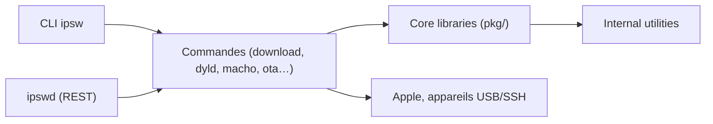

# blacktop/ipsw

> Boîte à outils en ligne de commande pour analyser les firmwares iOS/macOS, pour chercheurs en sécurité.

## Le problème
Télécharger, extraire et analyser les firmwares Apple (IPSW, OTA, dyld_shared_cache, noyau) demande une chaîne d'outils dispersée.

## Ce que ça fait vraiment
CLI `ipsw` (et démon REST `ipswd`) : téléchargement de firmwares, analyse Mach-O et désassemblage ARM, dyld_shared_cache, noyau, IMG4/iBoot/SEP, gestion d'appareils (`idev`), API App Store Connect, SSH/Frida. Décompilation assistée par LLM (Claude, OpenAI, Gemini, Ollama) en option.

## Comment c'est branché


## Essayer
```bash
brew install blacktop/tap/ipsw
ipsw download ipsw --device iPhone16,1 --latest
ipsw extract --kernel iPhone16,1_18.2_22C150_Restore.ipsw
ipsw dyld info /path/to/dyld_shared_cache_arm64
```

## Coût et pièges
Gratuit ; clés d'API LLM à ta charge pour la décompilation, et les échantillons peuvent être envoyés à ces services. Certaines opérations sont gourmandes en mémoire.

## Ce que ce n'est pas
Outil de recherche offensive et de rétro-ingénierie : réservé à un cadre autorisé. Tests exhaustifs « prévus » seulement.

## Alternatives
- Aucune alternative citée dans le README.

## Pour toi
À ignorer : outil de sécurité mobile, hors profil data/IA/MLOps.

