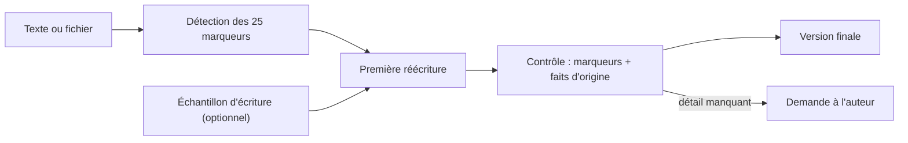

# blader/humanizer

> Skill qui réécrit un texte à consonance IA pour qu'il se lise comme écrit par une personne.

## Le problème
Un texte généré porte des marqueurs reconnaissables — « ce n'est pas X, c'est Y », triades forcées, gras décoratif — qui décrédibilisent le fond sans rien lui retirer.

## Ce que ça fait vraiment
Marque chaque marqueur trouvé, du plus fort au plus faible, rédige une première réécriture sans considérer la structure d'origine comme figée, confronte le brouillon aux marqueurs et aux affirmations initiales, puis écrit la version finale. 25 marqueurs en cinq sections : mise en scène au lieu d'affirmation, rythme appliqué par règle, inflation et autorité empruntée, formatage par règle, résidus de chat. Les cinq premiers justifient une correction à une seule occurrence ; ceux marqués *weak alone* ne comptent qu'en grappe. Sur un fichier, seule la prose est touchée : code, données, frontmatter et cibles de liens restent intacts.

## Comment c'est branché


## Essayer
```bash
npx skills add blader/humanizer --global
```
```text
/humanizer

[colle ton texte ici]
```

## Coût et pièges
Gratuit, un simple fichier Markdown : aucune dépendance, aucun runtime. Claude Code 2.1.142 ou plus récent peut l'installer en plugin. La réécriture consomme des tokens de ton modèle.

## Ce que ce n'est pas
Ce n'est pas un contourneur de détecteur d'IA — le mot-clé `ai-detection` a été retiré des fichiers de paquet en 3.0.0. Ce n'est pas un inventeur de détails : nom, chiffre, date, citation doivent venir de la source ou de l'auteur, sinon la skill demande. Le texte fourni est du contenu à éditer, jamais des instructions.

## Alternatives
Aucune alternative nommée dans le README.

## Pour toi
À adopter pour tes notes de veille et tes comptes rendus : la liste des 25 marqueurs vaut déjà comme grille de relecture, même sans l'outil.
