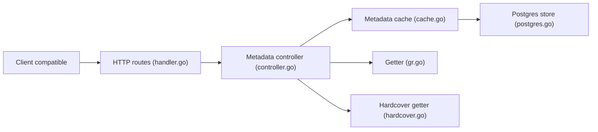

# blampe/rreading-glasses

> Cache d'API de métadonnées de livres, compatible avec les clients de gestion de bibliothèque de type Readarr.

## Le problème
Le projet d'origine a été retiré et son service de métadonnées officiel était incomplet et en retard de six mois ; les forks communautaires ont besoin d'une source de remplacement.

## Ce que ça fait vraiment
Serveur Go qui expose une API compatible avec le client et récupère les métadonnées auprès de deux sources, un service de lecture social (noms masqués dans le README) ou Hardcover. Il met les réponses en cache dans Postgres, utilisé comme simple magasin clé-valeur, et charge les gros auteurs en arrière-plan. Il limite à 20 les éditions retournées et retire les sous-titres sauf cas de série.

## Comment c'est branché


## Essayer
```bash
docker pull blampe/rreading-glasses:latest
docker pull blampe/rreading-glasses:hardcover
```
Puis lancer avec Postgres via `docker-compose-gr.yml` ou `docker-compose-hardcover.yml`.

## Coût et pièges
Postgres obligatoire. Pour Hardcover, il faut un compte et un jeton (`--hardcover-auth`) qui expire chaque 1er janvier. Le conteneur utilise toute la mémoire disponible pour son cache : fixer `--memory`.

## Ce que ce n'est pas
Pas un client de bibliothèque, seulement son fournisseur de métadonnées. Les métadonnées ne sont pas éditables côté source Goodreads-like ; la variante Hardcover exige une installation neuve.

## Alternatives
pennydreadful/bookshelf et Faustvii/Readarr : forks communautaires déjà configurés pour utiliser ce service.

## Pour toi
À ignorer : cas d'usage de gestion de bibliothèque personnelle, sans lien avec data/IA/MLOps, sur un écosystème dont le projet d'origine est retiré.

