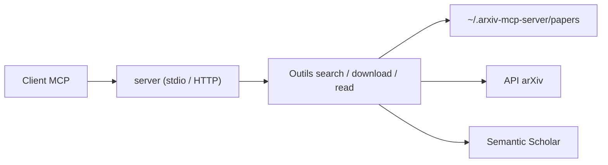

# blazickjp/arxiv-mcp-server

> Serveur MCP local pour chercher, lire par section et citer des papiers arXiv depuis un agent.

## Le problème
Un agent qui lit un PDF entier noie son contexte ; il lui faut un plan, une section à la fois, et des citations exactes.

## Ce que ça fait vraiment
19 outils : recherche arXiv, téléchargement en Markdown local, plan et lecture par section (Markdown ou LaTeX d'origine), recherche de passages, graphe de citations (Semantic Scholar), export BibTeX, veilles de sujets stockées sur disque, et recherche sémantique optionnelle (`[pro]`). Lectures bornées à 12 000 caractères par défaut. Sept prompts de workflow. Transport stdio, ou HTTP. Le schéma d'architecture est illisible : cette section suit le README.

## Comment c'est branché


## Essayer
```bash
uvx arxiv-mcp-server
claude mcp add --transport stdio --scope user arxiv -- uvx arxiv-mcp-server
uv tool install "arxiv-mcp-server[pdf]"
```

## Coût et pièges
Gratuit ; clé Semantic Scholar facultative pour éviter les limites. arXiv impose ~3 s entre requêtes. Le texte des papiers est un contenu non fiable (risque d'injection de prompt, dit le README). Ne pas l'installer via npm : un paquet homonyme sans rapport existe.

## Ce que ce n'est pas
Pas un moteur de recherche sémantique par défaut (extra `[pro]` avec embeddings locaux). Pas un gestionnaire de bibliothèque type Zotero.

## Alternatives
Non documenté dans le README.

## Pour toi
Adopter : installation en une ligne, lecture bornée qui économise le contexte, et cas d'usage central pour la veille papiers d'un profil IA.
