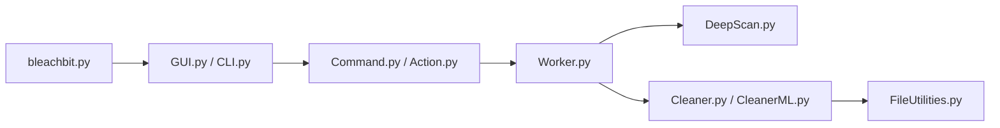

# bleachbit/bleachbit

> Nettoyeur de fichiers pour libérer de l'espace disque et protéger la vie privée, en interface graphique ou ligne de commande.

## Le problème
Caches, historiques et fichiers temporaires s'accumulent et laissent des traces.

## Ce que ça fait vraiment
Des « nettoyeurs » décrits en XML (CleanerML) listent ce qu'il faut supprimer ; l'interface GTK ou la CLI prévisualise puis supprime. Modules de recherche approfondie, écrasement, mise à jour, génération de fichiers leurres (chaff) via markovify, traductions par Weblate.

## Comment c'est branché


## Essayer
```bash
make install-deps
make -C po local
python3 bleachbit.py
python3 bleachbit.py --help
```

## Coût et pièges
Gratuit. Les dépendances système varient selon la distribution (Debian, Fedora, openSUSE, Arch). Toujours utiliser « Preview » avant « Delete » : la suppression est réelle.

## Ce que ce n'est pas
Pas une garantie d'effacement forensique : le README ne détaille pas ce point. Licence GPL-3.0 (copyleft).

## Alternatives
Aucune alternative nommée dans le README.

## Pour toi
À ignorer : utilitaire d'hygiène poste de travail, sans lien avec un travail data/IA/MLOps.

