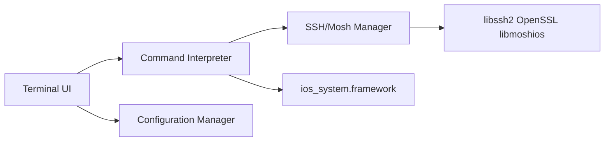

# blinksh/blink

> Terminal iOS avec Mosh et SSH, pour administrer des serveurs depuis un iPhone ou un iPad.

## Le problème
Garder une session SSH stable depuis un appareil mobile dont la connexion change sans cesse.

## Ce que ça fait vraiment
Terminal plein écran rendu par hterm de Chromium, sessions Mosh et SSH, clés et hôtes configurables, gestes, SplitView. Il embarque des commandes Unix (ls, cp, curl, scp, sftp, tar, python, lua) via `ios_system.framework`, sans pipe. L'architecture décrit interface, moteur de commandes, gestion de sessions et bibliothèques (libssh2, OpenSSL, libmoshios).

## Comment c'est branché


## Essayer
```bash
git clone --recursive https://github.com/blinksh/blink.git && \
    cd blink && ./get_frameworks.sh && ./get_resources.sh && \
    rm -rf Blink.xcodeproj/project.xcworkspace/xcshareddata/
cp template_setup.xcconfig developer_setup.xcconfig
```

## Coût et pièges
Disponible sur l'App Store (les conditions tarifaires ne sont pas dans le README). Compiler soi-même demande Xcode, un identifiant développeur Apple et un appareil.

## Ce que ce n'est pas
Pas un shell complet : pas de pipe, commandes limitées, écriture restreinte à `~/Documents` et quelques dossiers par le bac à sable iOS. Licence GPL-3.0 (copyleft).

## Alternatives
Aucune alternative nommée dans le README.

## Pour toi
À surveiller : utile pour surveiller un cluster GPU ou relancer un job depuis un iPad via Mosh, mais tu n'en auras besoin que si tu travailles depuis iOS.

