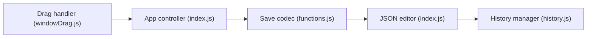

# bloodorca/hollow

> Éditeur en ligne des fichiers de sauvegarde de Hollow Knight, pour joueurs.

## Le problème
Les sauvegardes du jeu sont chiffrées et ne se modifient pas à la main.

## Ce que ça fait vraiment
Page web qui déchiffre un fichier `user1.dat`, affiche le JSON, permet de le modifier puis de télécharger un nouveau fichier chiffré. Un mode Switch (texte clair) et un historique local dans le navigateur existent d'après le code. Méthode reprise du Hollow Knight Save Manager de @KayDeeTee.

## Comment c'est branché


## Essayer
```bash
# Aucune commande dans le README : ouvrir https://bloodorca.github.io/hollow/ et suivre les étapes.
```

## Coût et pièges
Gratuit. Sauvegarder le fichier avant toute édition. Licence : aucune. Dernier push en 2019.

## Ce que ce n'est pas
Pas un outil de triche en ligne : tout se fait sur un fichier local. Pas de maintenance depuis 2019.

## Alternatives
Hollow Knight Save Manager (@KayDeeTee), source de la méthode.

## Pour toi
À ignorer : outil de jeu sans lien avec ton métier, abandonné depuis 2019.

