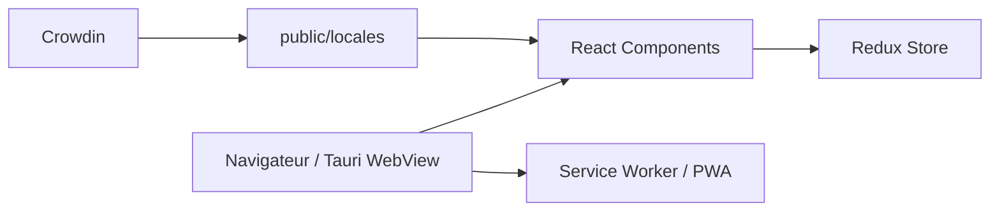

# blueedgetechno/win11React

> Réplique du bureau Windows 11 dans le navigateur, en React, pour la démonstration ou la curiosité.

## Le problème
Aucun besoin métier : l'auteur veut reproduire l'expérience du bureau Windows 11 avec des technologies web standard.

## Ce que ça fait vraiment
Application monopage React (17) et Redux, sans bibliothèque d'interface, stylée en SCSS et Tailwind. Reproduit menu Démarrer, widgets, fenêtres redimensionnables, calculatrice, bloc-notes, explorateur, écran de verrouillage, thèmes, multilingue. Fonctionne en PWA et peut être empaquetée en application de bureau via Tauri. Aucun backend.

## Comment c'est branché


## Essayer
```bash
docker run -d --restart unless-stopped --name win11react -p 3000:3000 blueedge/win11react:latest
winget install blueedge.win11react
```

## Coût et pièges
Gratuit. Dépôt archivé, dernier push en août 2024. Le flou ne fonctionne pas dans Firefox sans réglage `about:config`.

## Ce que ce n'est pas
Ce n'est pas un système d'exploitation ni un PC cloud, et le projet n'est affilié à Microsoft d'aucune façon.

## Alternatives
Aucune alternative nommée dans le README.

## Pour toi
À ignorer : projet de démonstration figé et archivé, sans utilité pour un flux data, IA ou MLOps.

