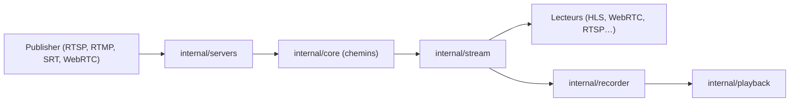

# bluenviron/mediamtx

> Serveur média sans dépendance qui reçoit, convertit, enregistre et relaie des flux vidéo et audio temps réel.

## Le problème
Faire circuler un flux d'une caméra ou d'un logiciel vers des lecteurs qui parlent d'autres protocoles exige des passerelles disparates.

## Ce que ça fait vraiment
Un seul exécutable Go qui joue le rôle de routeur média. Il accepte des flux en RTSP, RTMP, SRT, WebRTC, HLS, MPEG-TS, RTP, Media-over-QUIC, les convertit automatiquement vers d'autres protocoles, les enregistre en fMP4 ou MPEG-TS et les rejoue. Il gère authentification (interne, HTTP, JWT), rechargement de configuration à chaud, API de contrôle, métriques Prometheus et hooks de commandes externes. Il propose aussi des sources statiques (dont la caméra Raspberry Pi).

## Comment c'est branché

## Essayer
Aucune commande documentée dans le README (renvoi aux pages d'installation et de documentation).

## Coût et pièges
Gratuit, MIT. Fonctionne sur Linux, Windows et macOS, sans dépendance. Des images Docker existent (standard, Raspberry Pi, FFmpeg). Le README ne détaille ni sécurité par défaut ni dimensionnement.

## Ce que ce n'est pas
Pas un outil d'analyse vidéo ni de vision par ordinateur : il transporte les flux, il ne les interprète pas.

## Alternatives
Aucune alternative citée dans le README.

## Pour toi
Surveiller : brique plausible pour alimenter un pipeline de vision (caméras RTSP vers un service d'inférence), à tester sur ton cas.

