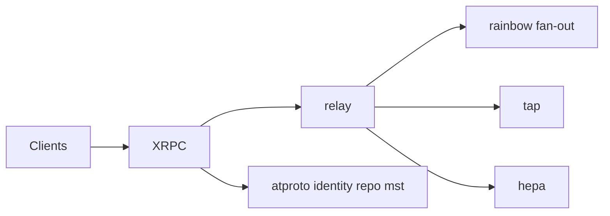

# bluesky-social/indigo

> Bibliothèques et services Go du protocole atproto (Bluesky) : relais, synchronisation, modération.

## Le problème
Bâtir un client ou un service sur le réseau social décentralisé Bluesky demande des types, une résolution d'identité et des services de référence.

## Ce que ça fait vraiment
Des services : `tap` (synchronisation et rattrapage), `relay`, `rainbow` (répartition du firehose), `hepa` (auto-modération pour Ozone). Des paquets : types Lexicon, client HTTP, OAuth, identité (DID, handle), dépôt et arbre de Merkle, crypto.

## Comment c'est branché


## Essayer
```bash
brew install go
go install github.com/bluesky-social/indigo/cmd/tap
tap
make build
make test
go run ./cmd/relay
```

## Coût et pièges
Le README prévient que les paquets sont en développement actif et peuvent casser. Les mainteneurs ne fournissent pas de support de build et peuvent ignorer issues et PR. Le schéma fourni cite BigSky et Palomar, absents de la liste actuelle : il semble périmé.

## Ce que ce n'est pas
Ce n'est pas l'implémentation TypeScript (PDS, AppView), qui est dans un autre dépôt.

## Alternatives
- bluesky-social/atproto : implémentation de référence en TypeScript (PDS, AppView).

## Pour toi
Ignorer : utile seulement si tu construis sur atproto en Go ; aucune valeur directe pour un flux data ou IA.

