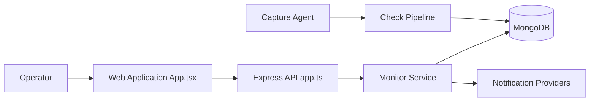

# bluewave-labs/checkmate

> Outil auto-hébergé de supervision de disponibilité, temps de réponse et incidents serveurs.

## Le problème
Savoir quand un site, un port ou un conteneur tombe, avec alertes et page de statut, sans payer un SaaS de monitoring.

## Ce que ça fait vraiment
Moniteurs HTTP (avec expiration SSL), ping, port, DNS, Docker, gRPC, WebSocket, JSON query, PageSpeed.
Cycle : check → stockage → seuil de changement d'état → incident → notification (e-mail, Slack, PagerDuty, Telegram…).
Pages de statut, maintenances planifiées ; l'agent Capture (Go) remonte CPU/RAM/disque.
Stack : React + Node.js/Express + MongoDB, image tout-en-un et worker séparable (`QUEUE_MODE`).

## Comment c'est branché


## Essayer
```bash
curl -O https://raw.githubusercontent.com/bluewave-labs/checkmate/master/docker/docker-compose.yaml
JWT_SECRET="$(openssl rand -hex 32)" docker compose up -d
```

## Coût et pièges
Gratuit, AGPL-3.0. MongoDB obligatoire ; `ENCRYPTION_KEY` requise pour les moniteurs Docker TLS. Le chart Helm reste sur les anciennes images v3.8.1.

## Ce que ce n'est pas
Pas un APM ni un outil de métriques applicatives détaillées. Pas un monitoring de modèles ML.

## Alternatives
Aucune nommée dans le README.

## Pour toi
À ignorer : supervision d'infra générique, sans rapport avec le suivi de modèles ou de pipelines data ; Uptime-style à garder en tête seulement pour un homelab.
