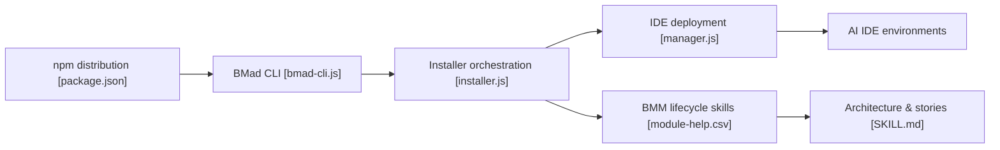

# bmad-code-org/BMAD-METHOD

> Méthode de développement agile pilotée par IA : skills installables pour cadrer, concevoir, coder et relire avec un assistant de code.

## Le problème
Les assistants de code transforment les hypothèses non dites en code, et le contexte se perd d'une conversation à l'autre.

## Ce que ça fait vraiment
Ce n'est pas une application : ce sont des skills Markdown (brief, PRD, UX, architecture, épics et stories, implémentation, revue de code) que l'installeur Node écrit dans l'outil de code choisi. Les artefacts d'une étape servent de contexte à la suivante. Des modules complémentaires existent (Builder, Test Architect, Game Dev Studio…), ainsi que des bundles web pour Gemini Gems et ChatGPT Custom GPTs.

## Comment c'est branché


## Essayer
```bash
npx skills add bmad-code-org/BMAD-METHOD
/plugin marketplace add bmad-code-org/bmad-plugins
codex plugin marketplace add bmad-code-org/bmad-plugins
```
Ensuite, dans l'outil de code : demander au skill `bmad` de lancer `bmad setup`, puis invoquer `bmad-build`.

## Coût et pièges
Le README annonce « aucun workflow payant ». Il faut un outil de code qui gère les skills, Node/npm/Git et `uv` ; ton abonnement ou tes jetons d'assistant restent à ta charge.

## Ce que ce n'est pas
Ce n'est pas un agent autonome hébergé : aucun backend, aucune base. C'est du contenu de prompts exécuté par ton assistant, donc la qualité dépend du modèle utilisé.

## Alternatives
Aucune alternative nommée dans le README.

## Pour toi
À surveiller : utile pour structurer des projets IA assistés par Claude Code ou Codex, mais la licence est « présente mais non identifiée » ; vérifie le fichier avant tout usage en entreprise.

