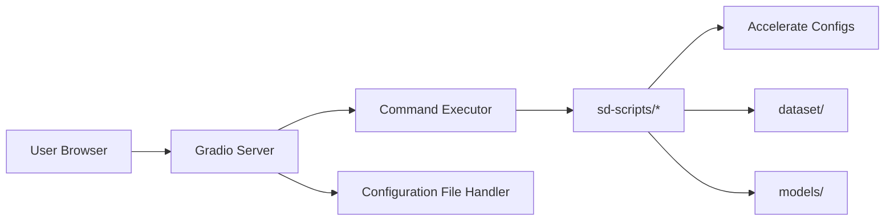

# bmaltais/kohya_ss

> Interface Gradio et CLI pour entraîner LoRA et fine-tunes de modèles de diffusion d'images.

## Le problème
Les scripts d'entraînement sd-scripts de Kohya exposent des centaines d'options en ligne de commande, difficiles à régler à la main.

## Ce que ça fait vraiment
GUI Gradio qui remplit les paramètres et génère/lance les commandes sd-scripts via Accelerate.
Entraînements LoRA, LoHa, LoKr, Dreambooth, fine-tune, Textual Inversion, LECO sur SD 1.5/2.x, SDXL, SD3, Flux.1, Lumina, HunyuanImage.
`config.toml` pour chemins par défaut ; mode `--headless` pour usage distant ; TensorBoard, captioning WD14.
Installation uv ou pip, Docker, Colab, Runpod.

## Comment c'est branché


## Essayer
```bash
./gui.sh --listen 0.0.0.0 --server_port 7860 --headless
```

## Coût et pièges
GPU requis (ou Colab/Runpod payant) ; installation détaillée dans des guides séparés par plateforme.
Sans `--headless` en SSH, des dialogues natifs peuvent bloquer l'entraînement.

## Ce que ce n'est pas
Pas un outil de génération d'images : il entraîne, l'inférence se fait ailleurs (extension auto1111).
macOS peu garanti ; masked loss non entièrement testé.

## Alternatives
- camenduru/kohya_ss-colab : même outil packagé pour Colab, maintenu par un tiers.

## Pour toi
À surveiller seulement si tu fine-tunes des modèles de diffusion : c'est l'outil de référence du domaine, hors d'un profil data/MLOps classique.
