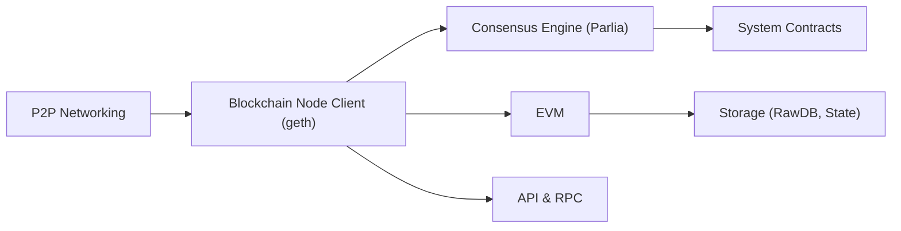

# bnb-chain/bsc

> Client de nœud BNB Smart Chain, fork de go-ethereum, pour opérateurs de nœuds et validateurs.

## Le problème
Participer à la chaîne BNB Smart Chain, compatible EVM, demande un client complet avec son consensus propre.

## Ce que ça fait vraiment
Client `geth` modifié : consensus Parlia (Proof of Staked Authority, 21 validateurs), contrats système pour le staking et les sanctions, JSON-RPC via HTTP, WebSocket et IPC. Il livre aussi `clef`, `devp2p`, `abigen`, `bootnode`, `evm` et `rlpdump`.

## Comment c'est branché


## Essayer
```bash
make geth
./geth --config ./config.toml --datadir ./node --cache 8000 --rpc.allow-unprotected-txs --history.transactions 0
```
Le README détaille aussi le téléchargement des binaires, des configs et du snapshot.

## Coût et pièges
Nœud complet mainnet : 3 To de SSD, 16 cœurs et 64 Go de RAM. Ouvrir HTTP/WS expose le nœud à des attaques.

## Ce que ce n'est pas
Pas une bibliothèque de développement de contrats. La licence LGPL-3.0 impose des obligations de redistribution.

## Alternatives
Aucune alternative nommée dans le README (go-ethereum est cité comme base du fork).

## Pour toi
À ignorer pour un profil data/IA : l'infrastructure lourde ne se justifie que si tu exploites un nœud BSC.

