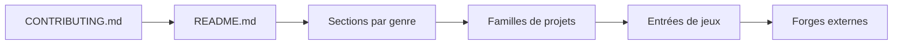

# bobeff/open-source-games

> Liste classée par genre de jeux vidéo open source et de réimplémentations libres de jeux commerciaux.

## Le problème
Retrouver des jeux libres et des moteurs de réimplémentation (Doom, OpenRCT2, OpenTTD…) éparpillés sur plusieurs forges.

## Ce que ça fait vraiment
Un README Markdown organisé par genres (stratégie, FPS, RPG, course…), avec pour chaque entrée un court descriptif et un lien vers le dépôt source (GitHub, GitLab, Codeberg, SourceForge). Aucun code d'application : seul `scripts/coauthor.py` sert aux contributeurs. La liste se termine par d'autres listes de référence.

## Comment c'est branché

## Essayer
Aucune commande : la liste se lit dans le README.

## Coût et pièges
Gratuit. Les jeux listés ont chacun leur licence, souvent avec des données d'origine à fournir ; certains liens peuvent être morts, l'entretien est manuel.

## Ce que ce n'est pas
Ce n'est ni un lanceur ni un catalogue de binaires : le dépôt ne contient aucun jeu. Les liens pointent vers des projets tiers non audités.

## Alternatives
Le README renvoie lui-même à d'autres listes : Awesome Open Source Games, Awesome Game Remakes, Libre Game Wiki.

## Pour toi
Ignorer : liste de loisir sans rapport avec un travail data/IA/MLOps, sauf pour chercher un environnement de jeu à utiliser en apprentissage par renforcement ; le README n'aborde pas ce sujet.

