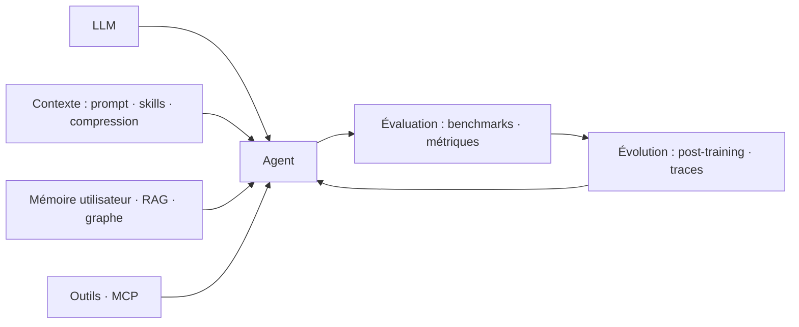

# bojieli/ai-agent-book

> Livre ouvert en dix chapitres sur les agents IA, avec 109 expériences reproductibles.

## Le problème
Les ressources sur les agents sautent du concept à la démo. Sans chaîne complète — contexte, mémoire, outils, évaluation, post-entraînement — on assemble sans comprendre les arbitrages.

## Ce que ça fait vraiment
Déroule la formule **Agent = LLM + contexte + outils** sur dix chapitres : ingénierie du contexte (KV cache, Agent Skills, compression), mémoire utilisateur et RAG, outils et protocole MCP, agents de code, extension des espaces d'observation et d'action (asynchrone, voix, Computer Use, robotique), évaluation, post-entraînement (SFT vs RL), évolution continue, collaboration multi-agents. 109 expériences associées, PDF/EPUB en 15 langues, lecture en ligne avec surlignage et notes.

## Comment c'est branché


## Essayer
```bash
uv sync --locked --extra ch1
uv run python chapter1/context/main.py
cd book && bash build_pdf.sh
```

## Coût et pièges
Apache 2.0, livre et code gratuits. Les expériences qui appellent un modèle exigent au moins une clé de fournisseur (Kimi, GLM, DeepSeek, SiliconFlow, OpenRouter…) ; le README met en avant un sponsor revendeur d'API. Python 3.11–3.13, certaines expériences du chapitre 8 demandent 3.12+. 22 dépôts externes à cloner à la main pour les chapitres 6, 7, 8 et 10, épinglés sur des SHA immuables.

## Ce que ce n'est pas
Le README est net : cloner les sources ou réussir l'installation **ne vaut pas** exécution d'une expérience — l'état réel est tracé dans `docs/EXPERIMENT_STATUS.md`. Le code compagnon est généré par un agent de code et n'est pas relu ligne à ligne par l'auteur. Le texte de référence est en chinois ; les autres langues sont des traductions communautaires qui peuvent retarder.

## Alternatives
- bojieli/ai-infra-book : le tome jumeau, sur l'infrastructure d'entraînement et d'inférence.

## Pour toi
À adopter : la table des matières seule est une grille d'audit solide pour tout agent que tu construis ou évalues.
