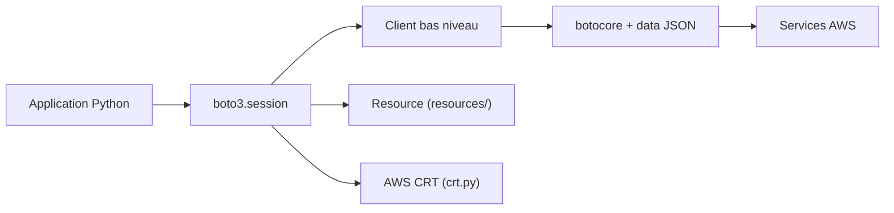

# boto/boto3

> SDK Python officiel d'Amazon Web Services, pour appeler S3, EC2, DynamoDB et les autres services.

## Le problème
Appeler les API AWS en HTTP signé à la main est fastidieux et source d'erreurs.

## Ce que ça fait vraiment
Une session (`session.py`) charge identifiants et région, puis fabrique des clients de bas niveau, pilotés par des modèles JSON de services et appuyés sur `botocore`, et des ressources orientées objet qui les enveloppent. S'ajoutent paginateurs, attentes (waiters) et une intégration optionnelle AWS CRT. Maintenu par AWS.

## Comment c'est branché


## Essayer
```bash
python -m venv .venv
. .venv/bin/activate
python -m pip install boto3
```
Puis, dans Python : `import boto3; s3 = boto3.resource('s3')`.

## Coût et pièges
Le SDK est gratuit, mais les services appelés sont facturés par AWS. Identifiants dans `~/.aws/credentials` et région dans `~/.aws/config`. Le support de Python 3.9 a pris fin le 2026-04-29.

## Ce que ce n'est pas
Pas une abstraction multi-cloud : il ne parle qu'à AWS. Le README renvoie à l'aide communautaire et à Stack Overflow, avec une bande passante de support limitée.

## Alternatives
Aucune alternative nommée dans le README.

## Pour toi
À adopter : passage obligé pour lire et écrire sur S3 ou piloter SageMaker depuis Python, sans discussion dès que ton infrastructure est sur AWS.

