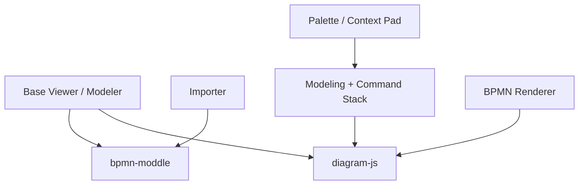

# bpmn-io/bpmn-js

> Visionneuse et éditeur de diagrammes BPMN 2.0 dans le navigateur, pour intégrer la modélisation de processus dans une application web.

## Le problème
Afficher ou éditer des processus métier BPMN dans une application web sans écrire un moteur de rendu de diagrammes.

## Ce que ça fait vraiment
Importe du XML BPMN 2.0, le rend dans un conteneur de page et permet de l'éditer (palette, menu contextuel, aimantation, outil d'espacement, règles BPMN). S'appuie sur `bpmn-moddle` (lecture/écriture XML) et `diagram-js` (rendu et édition). Extensible par modules.

## Comment c'est branché


## Essayer
```bash
npm install
npm run all
npm start
npm run dev
```

## Coût et pièges
Gratuit. La licence est présente mais non reconnue par GitHub : à lire avant tout usage commercial. Un peu de configuration est nécessaire pour construire le dernier instantané de développement.

## Ce que ce n'est pas
Ce n'est pas un moteur d'exécution de processus : il dessine et édite des diagrammes, il ne les exécute pas.

## Alternatives
Aucune alternative nommée dans le README.

## Pour toi
À surveiller : pertinent seulement si tu exposes des workflows (orchestration, validation) à des utilisateurs métier dans une interface web ; vérifier la licence d'abord.

