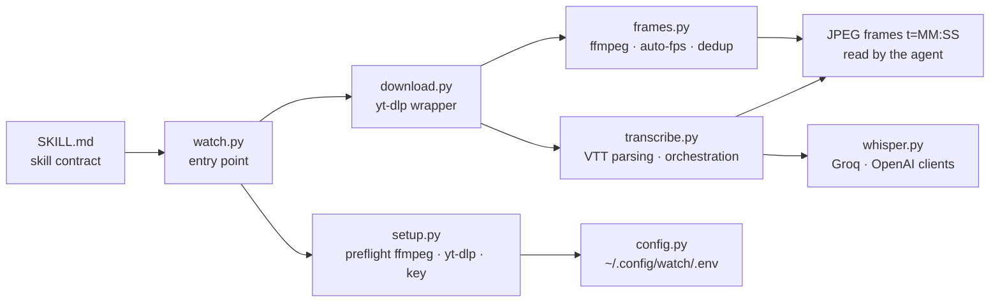

# bradautomates/claude-video

> **A skill that lets an agent actually watch a video: extracted frames plus a timestamped transcript.**

## The problem

An agent can read a page, run a script, browse a repo. A video, no: you paste a YouTube link
and it guesses from the title, or pulls a transcript that misses everything happening on
screen. The README states it plainly — around 90% of what is on screen is lost — and for a
screen recording, an ad creative or a bug demo, that is exactly where the information sits.

## What it actually does

`/watch <url or path> <question>`. The script checks captions first, downloads only what the
run needs, extracts frames, pulls a timestamped transcript, and the agent `Read`s each JPEG as
an image in its context.

- **Sources**: any URL `yt-dlp` supports — YouTube, Loom, TikTok, X, Instagram, plus "a few
  hundred more" — or a local `.mp4` / `.mov` / `.mkv` / `.webm` file.
- **Transcript**: native captions from the source when they exist (free), otherwise a mono
  16 kHz 64 kbps mp3 clip is shipped to Whisper — Groq's `whisper-large-v3` (preferred) or
  OpenAI's `whisper-1`. `--no-whisper` disables the fallback.
- **Four detail modes**, measured in the README on a 49:08 video: `transcript` (0 frames,
  ~4.5 s, no download), `efficient` (keyframes only, 50 frames, ~0.5 s), `balanced`
  (scene-change detection, cap 100), `token-burner` (same engine, uncapped).
- **Frame budget scales with duration**: ~30 frames under 30 s, ~80 between 3 and 10 minutes,
  100 at the cap beyond that, with a "sparse scan" warning and advice to re-run on a
  `--start` / `--end` window (up to 2 fps).
- **Deduplication on by default**: one `ffmpeg` call scales each frame to a 16×16 grayscale
  thumbnail, then pure-stdlib Python computes the mean absolute difference against the *last
  kept* frame; at or below the 2.0 threshold the frame is dropped. The cap applies after, so
  the budget is not spent on a held slide.

## How it is wired

No code-derived diagram exists for this repo: the graph below is reconstructed from the
README's "Structure" section, which names the files under `skills/watch/scripts/`.



## Try it

The two install paths the README leads with, copied as-is:

```
/plugin marketplace add bradautomates/claude-video
/plugin install watch@claude-video
```

```bash
npx skills add bradautomates/claude-video -g
```

Then a call, also taken from the README:

```
/watch https://youtu.be/dQw4w9WgXcQ what happens at the 30 second mark?
/watch https://youtu.be/abc --start 2:15 --end 2:45
```

For claude.ai, the README points to the `watch.skill` bundle from the latest release, dropped
into Settings → Capabilities → Skills, after enabling "Code execution and file creation".

## Cost and traps

- **Frames are the cost.** The README uses Anthropic's `width × height / 750` rule: at the
  default 512px width a 720p frame is 512×288, about 197 tokens; `--resolution 1024` roughly
  4×s that. On the test video, ~9.8k image tokens in `efficient`, ~22.8k in `token-burner` —
  yet the transcript alone was about 26.6k text tokens.
- **The API key is not always needed**: only when a video has no caption track at all — local
  files, TikToks, some Vimeos. It is then yours to pay for, at Groq or OpenAI, and your audio
  leaves for a third party.
- **System dependencies**: `ffmpeg` and `yt-dlp` must be on the PATH. The first run installs
  them via `brew` on macOS; on Linux and Windows the README says the `apt` / `dnf` / `pipx` /
  `winget` commands are only **printed**, not run.
- **Long videos**: past roughly 10 minutes the capped modes spread frames thin and coverage
  degrades. This is documented as guidance, not a hard ceiling.
- **One author**, Brad Bonanno, who also makes content and sells services around the project:
  the repo's trajectory rests on one person.

## What it is not

- **Not a video model and not a generation tool**: nothing is produced, everything is read.
- **Not frame-by-frame video understanding.** The agent sees a sample — keyframes or scene
  cuts, deduplicated and capped. A brief gesture between two kept frames does not exist for it.
- **Not a hosted service**: the script runs on your machine, with your binaries, your temp
  directory and possibly your Whisper key.
- **Not Claude-Code-only** despite the name: the README documents `npx skills` installs for
  Codex, Cursor, Copilot and Gemini CLI, and the repo ships a `.codex-plugin/` and an
  `AGENTS.md`.

## Alternatives

| | When to prefer it |
|---|---|
| **calesthio/OpenMontage** | Catalogue neighbour on the other side: producing and editing video with an agent, not reading it. Complementary rather than a substitute. |
| **Emily2040/seedance-2.0** | Catalogue neighbour, also shipped as an agent skill, but for directing video generation. Same delivery format, opposite purpose. |
| **`yt-dlp` + `ffmpeg` + Whisper by hand** | The three building blocks the README says it is built on. Prefer them if you want control over sampling and output format; you then rewrite auto-fps, dedup and VTT parsing yourself. |

For agent video reading specifically, no directly comparable alternative sits among the
neighbours offered.

## For you

The highest-return use is diagnosis: a screen recording of a bug or a demo someone sends you,
`/watch bug-repro.mov`, and the answer is about what is actually displayed. Second use: turning
a 50-minute talk or tutorial into usable notes, starting with `--detail transcript` (no
download at all) then targeting the useful moments with `--timestamps` or a `--start`/`--end`
window — that is where the quality-per-token ratio is best. Keep `token-burner` for the cases
where visual completeness genuinely matters.
