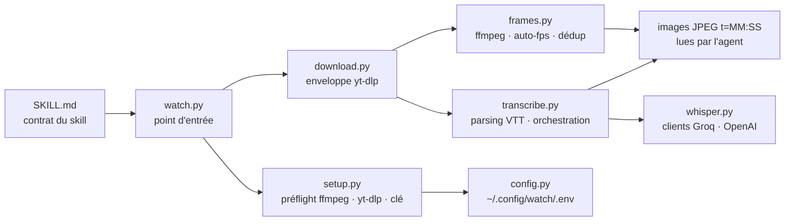

# bradautomates/claude-video

> **Skill qui fait vraiment regarder une vidéo à un agent : images extraites plus transcript horodaté.**

## Le problème

Un agent sait lire une page, lancer un script, parcourir un dépôt. Une vidéo, non : on lui
colle un lien YouTube et il devine depuis le titre, ou récupère un transcript qui laisse de
côté tout ce qui se passe à l'écran. Le README pose le constat tel quel — « 90 % de ce qui est
à l'écran » manque — et pour un enregistrement d'écran, une créa publicitaire ou une démo de
bug, c'est justement là que se trouve l'information.

## Ce que ça fait vraiment

`/watch <url ou chemin> <question>`. Le script cherche d'abord les sous-titres, ne télécharge
que ce dont il a besoin, extrait des images, récupère un transcript horodaté, et l'agent `Read`
chaque JPEG comme image dans son contexte.

- **Sources** : toute URL que gère `yt-dlp` — YouTube, Loom, TikTok, X, Instagram, « plus
  quelques centaines d'autres » — ou un fichier local `.mp4` / `.mov` / `.mkv` / `.webm`.
- **Transcript** : sous-titres natifs du site quand ils existent (gratuit), sinon extraction
  d'un mp3 mono 16 kHz 64 kbps envoyé à Whisper — `whisper-large-v3` chez Groq (préféré) ou
  `whisper-1` chez OpenAI. `--no-whisper` coupe la bascule.
- **Quatre niveaux de détail** mesurés dans le README sur une vidéo de 49:08 : `transcript`
  (0 image, ~4,5 s, aucun téléchargement), `efficient` (images clés seules, 50 images, ~0,5 s),
  `balanced` (détection de changement de plan, plafond 100), `token-burner` (même moteur, sans
  plafond).
- **Budget d'images** indexé sur la durée : ~30 images sous 30 s, ~80 entre 3 et 10 min, 100 au
  plafond au-delà, avec un avertissement « sparse scan » et le conseil de relancer sur une
  fenêtre `--start` / `--end` (jusqu'à 2 images/s).
- **Déduplication** activée par défaut : une passe `ffmpeg` réduit chaque image en vignette
  16×16 en niveaux de gris, puis calcule en Python pur la différence absolue moyenne avec la
  **dernière image conservée** ; au-dessous du seuil de 2.0, l'image est jetée. Le plafond
  s'applique après, pour ne pas dépenser le budget sur une diapositive figée.

## Comment c'est branché

Aucun diagramme tiré du code n'existe pour ce dépôt : ce schéma est reconstruit depuis la
section « Structure » du README, qui nomme les fichiers de `skills/watch/scripts/`.



## Essayer

Les deux voies d'installation mises en avant par le README, copiées telles quelles :

```
/plugin marketplace add bradautomates/claude-video
/plugin install watch@claude-video
```

```bash
npx skills add bradautomates/claude-video -g
```

Puis un appel, également repris du README :

```
/watch https://youtu.be/dQw4w9WgXcQ what happens at the 30 second mark?
/watch https://youtu.be/abc --start 2:15 --end 2:45
```

Pour claude.ai, le README renvoie au `watch.skill` de la dernière release, à déposer dans
Settings → Capabilities → Skills, après avoir activé « Code execution and file creation ».

## Coût et pièges

- **Les images sont le coût.** Le README chiffre avec la règle `largeur × hauteur / 750` : à
  512 px de large, une image 720p fait 512×288, soit ≈197 tokens ; `--resolution 1024`
  quadruple à peu près. Sur la vidéo test, ~9,8k tokens d'images en `efficient`, ~22,8k en
  `token-burner` — mais le transcript seul pesait ≈26,6k tokens de texte.
- **La clé d'API n'est pas toujours nécessaire** : seulement quand la vidéo n'a aucune piste de
  sous-titres — fichiers locaux, TikTok, certains Vimeo. Elle est alors à ta charge, chez Groq
  ou OpenAI, et ton audio part chez un tiers.
- **Dépendances système** : `ffmpeg` et `yt-dlp` doivent être sur le PATH. Le premier appel les
  installe via `brew` sur macOS ; sur Linux et Windows le README dit que les commandes `apt` /
  `dnf` / `pipx` / `winget` sont seulement **affichées**, pas exécutées.
- **Vidéos longues** : au-delà de ~10 minutes, les modes plafonnés étalent les images et la
  couverture s'amincit. C'est documenté comme une indication, pas une limite dure.
- **Un seul auteur**, Brad Bonanno, qui produit aussi du contenu et vend des prestations autour
  du projet : la trajectoire du dépôt tient à une personne.

## Ce que ce n'est pas

- **Ce n'est pas un modèle vidéo ni un outil de génération** : rien n'est produit, tout est lu.
- **Ce n'est pas une compréhension vidéo image par image.** L'agent voit un échantillon —
  images clés ou changements de plan, dédupliqué et plafonné. Un geste bref entre deux images
  retenues n'existe pas pour lui.
- **Ce n'est pas un service hébergé** : le script tourne chez toi, avec tes binaires, ton
  disque temporaire et éventuellement ta clé Whisper.
- **Ce n'est pas réservé à Claude Code** malgré le nom : le README documente l'installation via
  `npx skills` pour Codex, Cursor, Copilot, Gemini CLI, et le dépôt porte un `.codex-plugin/`
  et un `AGENTS.md`.

## Alternatives

| | Quand le préférer |
|---|---|
| **calesthio/OpenMontage** | Voisin du catalogue, sur l'autre versant : produire et monter de la vidéo par agent, pas la faire lire. Complémentaire plutôt que substituable. |
| **Emily2040/seedance-2.0** | Voisin du catalogue, aussi distribué comme skill d'agent, mais pour diriger une génération vidéo. Même format de livraison, objet inverse. |
| **`yt-dlp` + `ffmpeg` + Whisper à la main** | Les trois briques que le README déclare utiliser. À préférer si tu veux maîtriser l'échantillonnage et le format de sortie ; tu réécris alors l'auto-fps, la déduplication et le parsing VTT. |

Pour la lecture de vidéo par un agent, aucune alternative directement comparable parmi les
voisins proposés.

## Pour toi

L'usage le plus rentable est le diagnostic : un enregistrement d'écran d'un bug ou d'une démo
qu'on te transmet, `/watch bug-repro.mov`, et la réponse porte sur ce qui est réellement
affiché. Deuxième usage : transformer une conférence ou un tutoriel de 50 minutes en notes
exploitables, en commençant par `--detail transcript` (aucun téléchargement) puis en ciblant
les moments utiles avec `--timestamps` ou une fenêtre `--start`/`--end` — c'est là que le
rapport qualité/tokens est le meilleur. Réserve `token-burner` aux cas où la complétude
visuelle compte vraiment.
