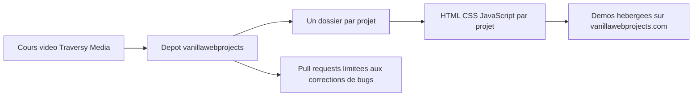

# bradtraversy/vanillawebprojects

> **Twenty framework-free browser JavaScript mini-projects, the code companion to a paid video course.**

## The problem

Learning browser JavaScript without a framework calls for finished, complete examples rather
than snippets. The README never states that problem itself: it simply presents the repo as
"the main repository for all of the projects in the course".

## What it actually does

It collects twenty standalone projects, each in its own folder: form-validator,
movie-seat-booking, custom-video-player, exchange-rate, dom-array-methods, modal-menu-slider,
hangman, meal-finder, expense-tracker, music-player, infinite_scroll_blog, typing-game,
speech-text-reader, memory-cards, lyrics-search, relaxer-app, breakout-game,
new-year-countdown, speak-number-guess, product-filtering. Every row of the README table links
to the folder holding the code and to a live demo on vanillawebprojects.com. It is neither a
library nor a tool: no API, no package, no binary is shipped.

## How it is wired



The README implies a flat layout: one folder per project at the repository root, each folder
self-contained. The only thing tying them together is the video course they support and the
demo site that serves each project at `vanillawebprojects.com/projects/<folder-name>/`. No
build step, shared dependency or common tooling is documented.

## Trying it

```
No command is documented in the README: no install, no build, no dev server.
The README offers only links to the project folders and to the online demos.
```

With no documented setup, all that remains is reading the code in each folder and opening the
published demos.

## Cost and traps

Browsing the repo needs no API key, no account, no Docker and no GPU. The course itself is
paid, though: the README points to traversymedia.com and to a Udemy page carrying a referral
code, which makes the repo deliberately partial without the course. The main trap is that
**no license is declared**, so reusing the code in a personal or professional project is not
legally covered. A second explicit constraint: pull requests are accepted only for bug fixes,
so the code stays in line with the course — improvements and new features are turned down.

## What it is not

It is not a library nor a reusable starter kit: nothing is packaged or versioned for import.
It is not a living project in the usual sense either, since the contribution policy freezes
the code on the course content by design. And it is not standalone documentation: the README
is a table of links, the explanation lives in the paid videos.

## Alternatives

The README names no comparable repository and no catalogue neighbours were supplied: no
comparable alternative in the catalogue. Its only outbound references are the Traversy Media
course and its Udemy edition, which are paid products rather than repositories.

## For you

For a data / AI / MLOps profile there is nothing here: no Python, no pipeline, no reusable
tooling, and a missing license that rules out borrowing code with confidence. Skip it, unless
you occasionally need to refresh browser JavaScript to hack together a demo interface.
