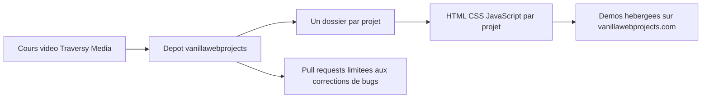

# bradtraversy/vanillawebprojects

> **Vingt mini-projets web en JavaScript sans framework, support de code d'un cours vidéo payant.**

## Le problème

Apprendre le JavaScript du navigateur sans passer par un framework demande des exemples
complets et finis, pas des extraits. Le README ne formule pas ce problème lui-même : il se
présente comme « the main repository for all of the projects in the course ».

## Ce que ça fait vraiment

Le dépôt rassemble vingt projets indépendants, chacun dans son propre dossier : form-validator,
movie-seat-booking, custom-video-player, exchange-rate, dom-array-methods, modal-menu-slider,
hangman, meal-finder, expense-tracker, music-player, infinite_scroll_blog, typing-game,
speech-text-reader, memory-cards, lyrics-search, relaxer-app, breakout-game,
new-year-countdown, speak-number-guess, product-filtering. Chaque entrée du tableau du README
pointe vers le dossier du code et vers une démo en ligne sur vanillawebprojects.com. Le dépôt
n'est ni une bibliothèque ni un outil : il ne fournit aucune API, aucun paquet, aucun binaire.

## Comment c'est branché



Le README décrit une arborescence plate : la racine du dépôt contient un dossier par projet,
nommé comme le projet lui-même, et chaque dossier est autonome. Le seul lien entre eux est le
cours vidéo dont ils sont le support, et le site de démos qui expose chaque projet à l'URL
`vanillawebprojects.com/projects/<nom-du-dossier>/`. Le README ne documente ni build, ni
dépendances partagées, ni outillage commun.

## Essayer

```
Aucune commande n'est documentée dans le README : pas d'installation, pas de build,
pas de serveur de développement. Le README ne propose que les liens vers les dossiers
de projets et vers les démos en ligne.
```

Le README n'indique aucune étape de prise en main ; il ne reste que la lecture du code dans
chaque dossier et l'ouverture des démos publiées.

## Coût et pièges

Le dépôt est consultable sans clé d'API, sans compte, sans Docker et sans GPU. En revanche le
cours lui-même est payant : le README renvoie vers traversymedia.com et vers une page Udemy
avec un code de parrainage, ce qui rend le dépôt volontairement partiel sans le cours. Piège
principal : **aucune licence n'est déclarée**, donc la réutilisation du code dans un projet
personnel ou professionnel n'est pas juridiquement couverte. Autre contrainte explicite : les
pull requests ne sont acceptées que pour des corrections de bugs, afin que le code reste
aligné sur le cours — les améliorations et les nouvelles fonctionnalités sont refusées.

## Ce que ce n'est pas

Ce n'est pas une bibliothèque ni un starter kit réutilisable : rien n'est packagé, rien n'est
versionné pour être importé. Ce n'est pas non plus un projet vivant au sens habituel, puisque
la politique de contribution gèle volontairement le code sur le contenu du cours. Enfin, ce
n'est pas une documentation autonome : le README est un tableau de liens, l'explication est
dans les vidéos payantes.

## Alternatives

Le README ne nomme aucun autre dépôt comparable et aucun voisin de catalogue n'a été fourni :
aucune alternative comparable dans le catalogue. Les seuls renvois du README sont le cours
Traversy Media et sa version Udemy, qui sont des produits payants et non des dépôts.

## Pour toi

Pour un profil data / IA / MLOps, ce dépôt n'apporte rien : pas de Python, pas de pipeline,
pas d'outillage réutilisable, et une licence absente qui interdit d'y piocher du code
sereinement. Passe ton chemin, sauf besoin ponctuel de rafraîchir du JavaScript de navigateur
pour bricoler une interface de démonstration.
