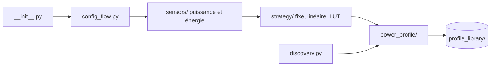

# bramstroker/homeassistant-powercalc

> Intégration Home Assistant qui estime la consommation d'appareils sans compteur, pour les utilisateurs domotique.

## Le problème
Lampes, ventilateurs et lecteurs multimédia n'ont pas de mesure de puissance ; installer une prise connectée par appareil coûte cher.

## Ce que ça fait vraiment
Elle crée dans Home Assistant des capteurs virtuels de puissance calculés d'après l'état de l'appareil (luminosité, couleur, vitesse), via des stratégies (fixe, linéaire, table de correspondance, multi-interrupteur, playbook, WLED, composite). Elle s'appuie sur une bibliothèque de profils mesurés par modèle, et ajoute capteurs d'énergie, de coût, compteurs utilitaires et groupes.

## Comment c'est branché

## Essayer
Aucune commande documentée dans le README : il renvoie au Quick Start Guide et à la documentation en ligne.

## Coût et pièges
Gratuit. Nécessite une instance Home Assistant. Les estimations valent ce que valent les profils mesurés ; les appareils absents de la bibliothèque demandent une configuration manuelle. Un composant d'analytique existe dans le code, sa nature n'est pas détaillée dans le README.

## Ce que ce n'est pas
Ce n'est pas un compteur : ce sont des estimations, pas des mesures. Le README fourni est court et ne détaille ni l'installation ni la télémétrie.

## Alternatives
Aucune alternative nommée dans le README.

## Pour toi
À ignorer : outil domotique sans lien avec un profil data/IA/MLOps ; seul l'exemple d'une bibliothèque de profils mesurés a valeur de curiosité.
