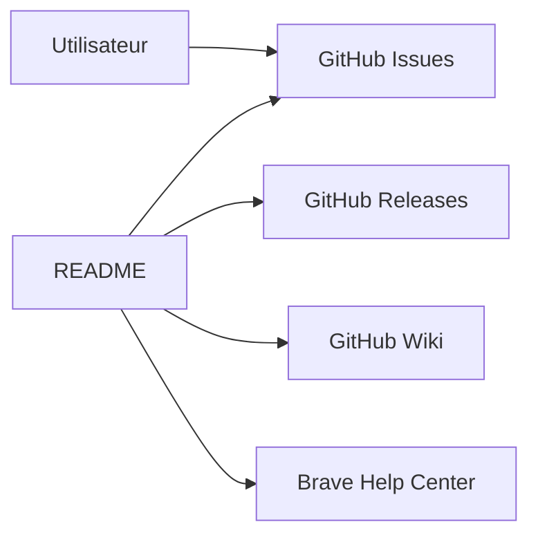

# brave/brave-browser

> Dépôt-portail de Brave : tickets, versions et wiki, sans le code source du navigateur.

## Le problème
Les utilisateurs et contributeurs ont besoin d'un point d'entrée pour signaler des bugs et retrouver les versions publiées.

## Ce que ça fait vraiment
Le README dit que ce dépôt n'est pas nécessaire pour compiler le navigateur : il ne contient que les issues, les releases et le wiki. Le code et les contributions sont dans `brave/brave-core`. Le README renvoie aussi à une politique de sécurité et au centre d'aide.

## Comment c'est branché

## Essayer
Aucune commande documentée.

## Coût et pièges
Gratuit. Plus de 10 000 issues ouvertes : ce dépôt sert de tracker, pas de code à lire ou à cloner.

## Ce que ce n'est pas
Ce n'est pas le code du navigateur : il se trouve dans `brave/brave-core`.

## Alternatives
Aucune alternative nommée dans le README (le dépôt du code, `brave/brave-core`, est cité).

## Pour toi
Ignorer : simple portail d'issues et de releases, sans matière technique ni lien avec la data ou l'IA.

