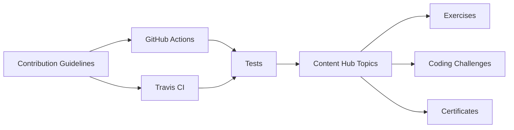

# bregman-arie/devops-exercises

> Recueil de 2 624 questions et exercices DevOps / SRE avec réponses, pour réviser des entretiens.

## Le problème
Préparer un entretien DevOps ou SRE sans support structuré oblige à glaner des questions un peu partout.

## Ce que ça fait vraiment
Des questions-réponses rangées par thème : réseau (TCP/IP, OSI, adresses MAC/IP), Linux, Kubernetes, AWS / Azure / GCP, Terraform, Ansible, CI/CD, Prometheus, Grafana, bases de données, conception de systèmes, soft skills…
Le dépôt ajoute des défis de code (Python, shell), des ressources de certification (AWS, Azure, Kubernetes), des scripts utilitaires et des tests lancés par GitHub Actions et Travis CI.
Tout se lit dans le README et le dossier `topics`.

## Comment c'est branché

## Essayer
Aucune commande documentée : on lit le README.

## Coût et pièges
Gratuit. Licence présente mais non identifiée par GitHub.

## Ce que ce n'est pas
L'auteur le dit : la plupart des questions ne sont pas de vraies questions d'entretien, et il ne faut pas tout apprendre. Les réponses sont courtes et de profondeur inégale.

## Alternatives
- KubePrep — application de révision Kubernetes citée dans le README.
- Linux Master — application de révision Linux citée dans le README.
- System Design Hero — application de révision de conception de systèmes citée dans le README.

## Pour toi
À ignorer, sauf pour réviser Kubernetes et CI/CD avant un entretien MLOps.
