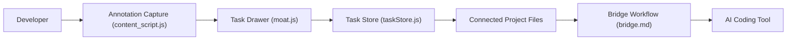

# breschio/drawbridge

> Extension Chrome pour annoter une app en cours d'exécution et générer des tâches lisibles par des agents de code.

## Le problème
Décrire un bug d'interface à un agent de code par du texte est imprécis ; il manque le sélecteur, la capture et le contexte.

## Ce que ça fait vraiment
On clique sur un élément ou on dessine un rectangle, on laisse un commentaire ; l'extension capture sélecteur, contexte, boîte englobante et capture d'écran, et écrit des fichiers dans le projet connecté (`.moat/moat-tasks.md`, JSON détaillé, captures). Elle déploie une commande `/bridge` pour Claude Code, Codex et Windsurf, avec trois modes : pas à pas, par lots, « yolo ».

## Comment c'est branché


## Essayer
```bash
npm ci
npm test -- chrome-extension/background.test.js --runInBand
npm run build
```
Installation : `chrome://extensions`, mode développeur, « Load unpacked » sur `drawbridge/chrome-extension/`.

## Coût et pièges
Gratuit. L'extension se charge en mode non empaqueté et demande l'accès au dossier du projet ; elle modifie le `.gitignore`. Le mode « yolo bridge » traite tout sans validation.

## Ce que ce n'est pas
Ce n'est pas un outil de test visuel automatisé ni un service. Licence présente mais non identifiée par GitHub.

## Alternatives
Aucune alternative nommée dans le README.

## Pour toi
À surveiller : utile si tu itères sur une interface web avec un agent de code ; hors sujet pour du data/MLOps pur, et la licence floue est à clarifier.

