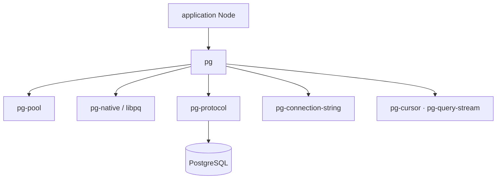

# brianc/node-postgres

> Client PostgreSQL non bloquant pour Node.js, JavaScript pur avec liaisons libpq optionnelles.

## Le problème
Parler à PostgreSQL depuis Node demande de gérer soi-même le pool de connexions, la conversion de
types et le protocole binaire.

## Ce que ça fait vraiment
Monorepo regroupant le module `pg` et ses satellites : `pg-pool` (pool de connexions), `pg-native`
(liaisons libpq), `pg-cursor`, `pg-query-stream`, `pg-connection-string` et `pg-protocol`. Le client
JavaScript pur et les liaisons natives partagent exactement la même API. Il couvre les requêtes
paramétrées, les instructions nommées avec cache de plan d'exécution, les notifications asynchrones
`LISTEN`/`NOTIFY`, l'import et l'export en masse par `COPY TO`/`COPY FROM`, et une coercition de
types JS ↔ PostgreSQL extensible. Fonctionne aussi sur bun, deno et cloudflare.

## Comment c'est branché


## Essayer
```bash
npm install pg
```
```bash
yarn
yarn lerna bootstrap
yarn test
```

## Coût et pièges
Gratuit. Une instance PostgreSQL est nécessaire ; pour le développement local il faut SSL activé et
une base vide de test, `libpq-dev` installé (les liaisons natives sont compilées pendant les tests),
et les variables `PG*` (`PGUSER`, `PGPASSWORD`…) configurées. `PGTESTNOSSL=1` permet de sauter les
tests SSL.

## Ce que ce n'est pas
Ce n'est pas un ORM : le README revendique une bibliothèque volontairement légère en abstractions,
et renvoie au wiki pour les modules complémentaires qui « complètent le tableau ». La documentation
d'usage n'est pas dans ce dépôt, elle a son propre dépôt source.

## Alternatives
Aucune alternative nommée ; la liste complète des extras se trouve sur le wiki du projet.

## Pour toi
Le client par défaut dès qu'un service Node de ta chaîne touche PostgreSQL ; `COPY FROM` et
`pg-query-stream` sont les deux points qui intéressent un usage data.
