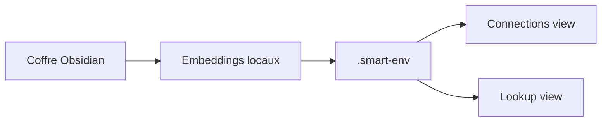

# brianpetro/obsidian-smart-connections

> Plugin Obsidian qui repère les notes sémantiquement proches grâce à des embeddings locaux.

## Le problème
Dans un coffre de milliers de notes, on ne retrouve plus les idées liées, faute de liens manuels.

## Ce que ça fait vraiment
Un modèle d'embeddings local indexe le coffre. Une vue Connexions liste les notes proches de la note courante ; une vue Lookup fait de la recherche sémantique. On peut épingler ou masquer des résultats, copier les liens, ou envoyer le contenu vers Smart Context pour un chat IA. Les fonctions avancées (connexions inline, scoring, Bases) sont dans des plugins Pro.

## Comment c'est branché
Le diagramme du dépôt n'a aucun composant lisible ; description générale seulement.

## Essayer
Le README ne donne aucune commande : installer depuis les plugins communautaires d'Obsidian, activer, puis ouvrir la commande « Open: Connection view ».

## Coût et pièges
Le noyau est gratuit et local, sans clé d'API. Le Pro est réservé aux soutiens payants. Licence présente mais non identifiée par GitHub ; le README parle de « source available ».

## Ce que ce n'est pas
Pas une recherche par mots-clés : une note contenant le texte exact peut ne pas apparaître. Les fonctions Pro ne sont pas dans la version gratuite.

## Alternatives
Le README ne nomme aucune alternative.

## Pour toi
À surveiller : utile si tu prends des notes techniques dans Obsidian, mais licence à clarifier et développeur unique.
