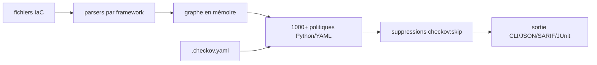

# bridgecrewio/checkov

> Analyse statique d'infrastructure as code et scan de dépendances, plus de 1000 politiques.

## Le problème
Une erreur de configuration cloud (bucket public, chiffrement absent) se découvre après le déploiement, quand elle est déjà exploitable.

## Ce que ça fait vraiment
Scanne Terraform, plan Terraform, CloudFormation, SAM, Kubernetes, Helm, Kustomize, Dockerfile, Serverless, Ansible, Bicep, ARM, OpenTofu, OpenAPI.
Scanne aussi les pipelines CI : Argo Workflows, Azure Pipelines, BitBucket, CircleCI, GitHub Actions, GitLab CI.
Analyse par graphe en mémoire, avec évaluation des variables et de leurs valeurs par défaut.
Détecte les credentials AWS dans les userdata EC2, les variables Lambda et les providers ; repère les secrets par regex, mots-clés et entropie.

## Comment c'est branché


## Essayer
```sh
pip3 install checkov
checkov --directory /user/path/to/iac/code
checkov -f tf.json --repo-root-for-plan-enrichment /user/path/to/iac/code
docker run --tty --rm --volume /user/tf:/tf --workdir /tf bridgecrew/checkov --directory /tf
```

## Coût et pièges
Le cœur est gratuit, mais le filtrage par sévérité (`--check MEDIUM`), le scan SCA et le scan d'image exigent `--bc-api-key`. Python 3.9 à 3.12 seulement. Checkov appelle l'API Prisma Cloud pour enrichir les résultats : `--skip-download` pour couper.

## Ce que ce n'est pas
Pas un scanner runtime : il lit des fichiers, pas un cluster vivant. Le README rappelle la limite de toute analyse statique — une ressource gérée à la main produira des faux positifs à supprimer par annotation. Le fichier de config doit venir d'une source de confiance, puisqu'il charge des checks custom.

## Alternatives
Aucune alternative nommée ; le README ne cite que Prisma Cloud, dont Checkov est la brique open source.

## Pour toi
À brancher en pre-commit ou en CI dès que tu écris du Terraform ou des manifests Kubernetes.
