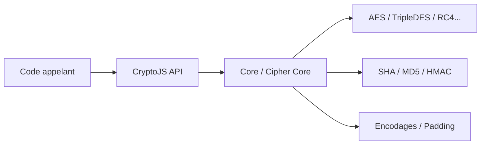

# brix/crypto-js

> Bibliothèque JavaScript de standards cryptographiques, abandonnée, à remplacer par le module natif `crypto`.

## Le problème
Il fallait des hachages et du chiffrement en JavaScript avant que navigateurs et Node n'aient une API native.

## Ce que ça fait vraiment
Des modules à importer séparément : AES, TripleDES, RC4, Rabbit, Blowfish, hachages MD5/SHA-1/SHA-2/SHA-3/RIPEMD160, HMAC, PBKDF2, encodages Base64/UTF-16, modes et remplissages. Depuis la 4.0.0, l'aléa vient du module `crypto` natif. Le 4.2.0 a changé l'algorithme et les itérations par défaut de PBKDF2.

## Comment c'est branché


## Essayer
```bash
npm install crypto-js
```
```javascript
var CryptoJS = require("crypto-js");
var ciphertext = CryptoJS.AES.encrypt('my message', 'secret key 123').toString();
```

## Coût et pièges
Le développement est arrêté (le README le déclare). La licence est présente mais non identifiée par GitHub. Les versions 3.1.x utilisaient `Math.random()`, non sûr ; la 3.2.0 est signalée comme à ne pas utiliser.

## Ce que ce n'est pas
Ce n'est pas une bibliothèque maintenue ni recommandée pour du nouveau code.

## Alternatives
Le module `crypto` natif de Node et des navigateurs, recommandé par le README lui-même.

## Pour toi
À ignorer : projet arrêté, licence floue, et l'auteur pointe lui-même vers l'API native, plus sûre pour tout nouveau code.

